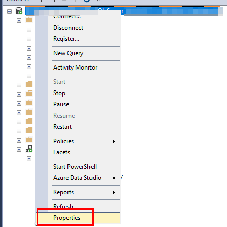
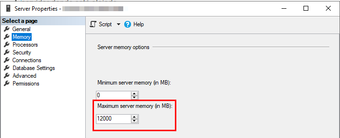
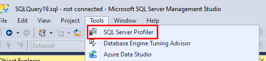
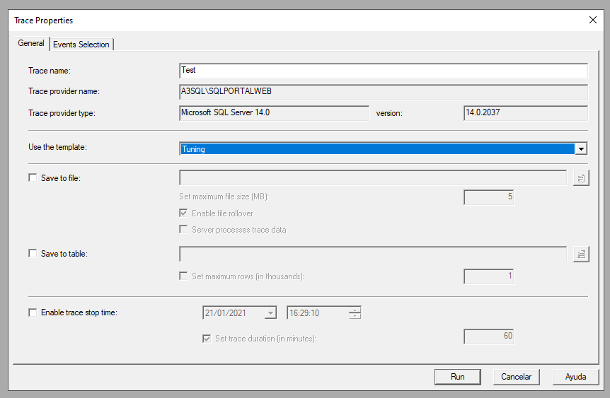
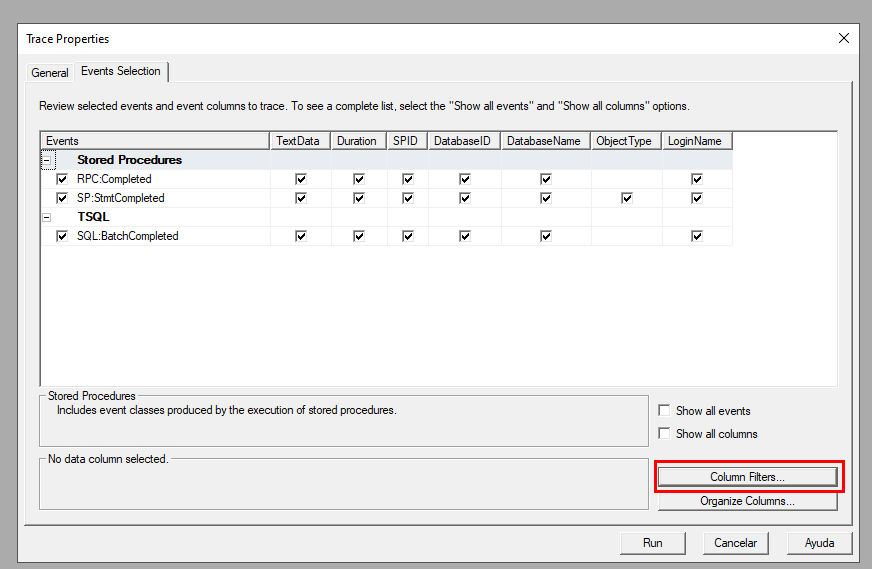
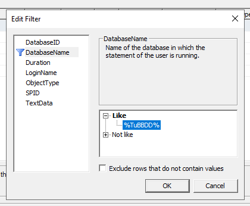
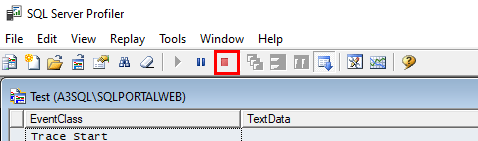
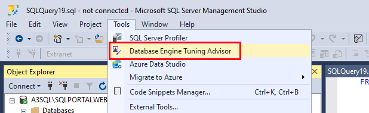
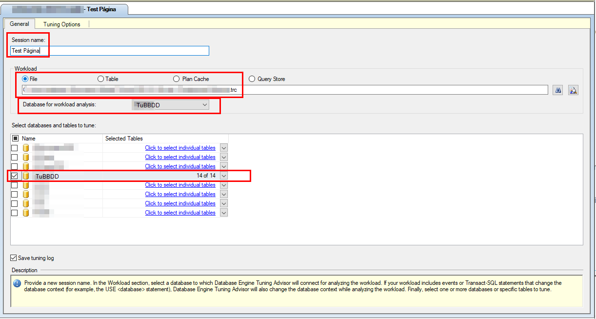
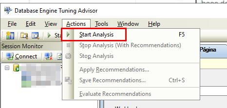

### El rendimiento de las BBDDs: un dolor de cabeza común para un desarrollador/a

En el mundo académico, se nos suele enseñar que hay muchos roles, especialidades o puestos de trabajo diferentes ligados al software: analista, diseñador, desarrollador, tester, administrador de bases de datos, etc. Sin embargo, la realidad es que **existen muchas personas que deben realizar todos estos roles a la vez**. En un entorno PYME, concretamente, es muy común que un desarrollador/a tenga que *ponerse varios gorros diferentes* a lo largo del día.

En este contexto, un problema con el que me he encontrado con cierta frecuencia es **la dificultad de una persona con un perfil de desarrollador para gestionar las bases de datos de sus aplicaciones de forma eficiente**. En caso de que esa persona pertenezca al departamento de IT de la empresa, otro escenario común suele ser la falta de conocimiento, para optimizar, sin mucho riesgo, a **las bases de datos o los servidores de BBDD de software de terceros**. Además, la lentitud de un programa o base de datos es una queja muy común entre los usuarios/as.

Es por ello que me he decidido a escribir este post con **3 consejos sencillos para mejorar el rendimiento de una base de datos SQL Server** de forma rápida y que no nos de muchos quebraderos de cabeza. Son cosas que me han servido para mejorar de forma considerable el rendimiento de muchas BBDDs (y sus aplicaciones asociadas) con poco esfuerzo y tiempo.

### Consejo 1: Ampliar la memoria RAM

Sí, puede que digas... ¡qué chorrada! Pero en mi experiencia ésta ha sido la solución más eficaz. En este sentido, **me he encontrado principalmente 3 escenarios diferentes:**

##### Utilización de la versión Express

Las licencias de SQL Server no son baratas, pero **es muy difícil que una aplicación pueda funcionar de manera eficiente en un entorno de producción con la versión gratuita de SQL Server. La licencia Standard tiene muchas ventajas, y puede albergar distintas instancias y bases de datos**, con lo cuál el coste por aplicación puede no llegar a ser tan alto. Incluso [**puedes montar un portal web de reporting sin coste adicional**](/archive/reporting-services-la-gran-olvidada/).

##### La creencia *rancia* de que hay que minimizar el uso de la RAM

**Hace unos años, la virtualización de servidores era casi inexistente y la RAM era cara.** Ya no. Pero hay much@s responsables y técnic@s de IT que siguen pensando de la manera antigua.

No dejes que *te coman el tarro*. Si no han virtualizado ya sus servidores, van muy tarde. Y no, la RAM no es cara, es muy barata. Mucho más que tu tiempo como desarrollador/a.

Si tus BBDDs tienen problemas de rendimiento, que te suban unos Gigas la RAM del servidor donde están alojadas y haz unas pruebas. En caso de que el rendimiento mejore considerablemente, dejadlo así y, si no hay tiempo para mayor análisis, enfocaros en cosas más importantes.

##### La instancia de SQL Server tiene la RAM limitada y ésta es insuficiente

Éste es un caso que a veces suele darse en instalaciones que nos han hecho terceros, o que hemos heredado de trabajadores/as anteriores. **La memoria RAM de las instancias de SQL Server puede limitarse**, y de hecho yo os recomiendo hacerlo así para controlar la RAM del servidor que utiliza el motor de BBDD. De otra forma, SQL Server funciona de modo *insaciable* y va *pillando* toda la RAM que puede, pudiendo afectar al rendimiento de otros servicios del servidor donde está alojado.

Puedes acceder a este parámetro dentro de SQL Server Management Studio haciendo click derecho sobre la instancia de SQL Server y pulsando sobre la opción Properties del menú emergente que te saldrá.

Dentro del panel que aparece, escoges la página Memory y modificas el parámetro Maximum Server Memory según tus necesidades y posibilidades.

### Consejo 2: Reconstruir índices

Ésta era la solución estrella cuando la RAM era cara. Poner una tarea nocturna que reconstruyera todos los índices de la base de datos cada día o semana. De esta manera, **minimizamos la fragmentación de éstos y conseguimos mejorar el rendimiento general de la BBDD**.

Cuando de repente *pillabas* una base de datos que no había sido mantenida durante años y le ejecutabas el script para reconstruir todos los índices, la mejora de rendimiento era muy considerable. Cuando la ejecutabas diaria o semanalmente, lógicamente, el cambio no era el mismo. Pero era una práctica muy habitual para que *no se fuera de madre*.

En mi experiencia, ya no aporta tanto como antes, cuando era un auténtico salvavidas cuando tenías un SQL Server Express o poca RAM, pero es una técnica que sigo utilizando.

Para hacerlo bien, lo suyo es crear un nuevo Job en el SQL Server Agent con un único Step que se ejecuta a una hora en la que la BBDD no esté siendo utilizada (normalmente a la noche o en fin de semana). En ese Step, debes incluir el código PL-SQL que contiene [**este fichero**](https://www.victorgomezdejuan.com/wp-content/uploads/2021/01/Rebuild-indexes.txt).

Solamente debes cambiar el texto 'TuBBDD' por el nombre de tu base de datos (puedes incluir más de una base de datos también). ¡Ah! Y aseguraté de ejecutar el Job con un usuario con permisos suficientes y de revisar las primeras ejecuciones al menos para ver que no se dan errores.

### Consejo 3: Tuning Advisor

Hay una diferencia importante entre este consejo y los dos anteriores. Los anteriores están pensados para mejorar el rendimiento general de una base de datos, y además no la modifican para nada. Este tercer consejo, en cambio, **está pensado para mejorar una consulta o proceso concreto de una aplicación que tire de una BBDD, y además supone modificar la base de datos.**

Y explico esto último. Cuando digo que vamos a modificar la base de datos, no digo que vayamos a cambiar su estructura principal de tablas, campos y claves. Me refiero a que, seguramente, la mejora conlleve añadir índices y estadísticas a las tablas de la base de datos. Ninguna aplicación va a fallar por esto, pero su rendimiento sí va a variar. En la grándisima mayoría de casos lo que vas a conseguir es mejorar el rendimiento de ese proceso concreto ralentizando mínimamente algunas acciones concretas de inserción y modificación. El resto de acciones, o se verán beneficiadas también, o la bajada de rendimiento será muy, muy pequeña. Teniendo en cuenta que la mayoría de aplicaciones tienen muchas más operaciones de consulta que de inserción/modificación/borrado, no suele haber problema. Pero el riesgo, aunque muy pequeño, está ahí. Así que no viene mal revisar antes qué vamos a hacer, e incluso hacer pruebas, backups, etc.

Bueno, al lío.Lo primero que tenemos que hacer es abrir SQL Server Management Studio (SSMS), y pulsar sobre la opción de Tools -> SQL Profiler. Esto nos va a permitir crear una traza, es decir, un fichero con un conjunto de operaciones sobre la BBDD.

Se nos abrirá una nueva pantalla para configurar la traza. Primero debemos escoger el servidor de BBDD sobre el que vamos a generar esa traza. Una vez seleccionado, en la pestaña General, debemos escribir un nombre para la traza y escoger la plantilla Tuning.

Posteriormente, vamos a la pestaña Events Selection, y pulsamos sobre la opción Column Filters...

Dentro de la ventana que nos aparece, seleccionamos la opción DatabaseName y, en Like, ponemos el nombre de nuestra base de datos.

Le damos a OK.

Antes de darle a Run, para que empiece a crear la traza, tenemos que asegurarnos de dos cosas: estamos en la pantalla de la aplicación que hace uso de la base de datos justo antes de empezar el proceso que nos va lento (generar un pedido, consultar facturas de cierto año, filtrar los empleados/as por oficina...) e, idealmente, debemos asegurarnos que nadie más está utilizando la aplicación. También puedes crearte un entorno de pruebas que replique las condiciones del entorno de producción. Al gusto.

Entonces, le damos a Run. Hacemos lo que sea que hagamos en la aplicación para que ésta haga uso de la BBDD. En la pantalla nos irán apareciendo las sentencias SQL que se van ejecutando. Cuando terminamos, pulsamos sobre el botón de Stop.

Ahora vamos a File -> Save As -> Trace File... Y guardamos la traza en nuestro equipo (fichero .trc).

Una vez tenemos el fichero de traza, cerramos la herramienta SQL Profiler y, en SSMS, pulsamos ahora sobre la opción Tools -> Database Engine Tuning Advisor.

Como en la anterior herramienta, volvemos a escoger el servidor de la BBDD sobre la que queremos ejecutar la traza para que el Tuning Advisor nos recomiende acciones.

Automáticamente, nos crea una sesión nueva. Le ponemos un nombre, escogemos nuestro fichero de traza en el campo Workload -> File, seleccionamos la base de datos en el desplegable de abajo y también en la lista de más abajo.

La pestaña Tuning Options la dejamos con los valores por defecto y pulsamos sobre Actions -> Start Analysis.

Una vez Tuning Advisor finaliza el análisis, nos muestra unas recomendaciones y una serie de informes. Nos informa, asimismo, del porcentaje de mejora esperado.

Podemos escoger las recomendaciones que queremos que nos aplique. Por defecto, aparecen todas marcadas. Una vez estemos de acuerdo con las recomendaciones, pulsamos sobre la opción Actions -> Apply Recommendations... y Tuning Advisor nos dará la opción de aplicarlas en ese momento o programar su aplicación.

¡Y listo! La verdad es que el porcentaje de mejora que ponen se suele cumplir bastante. Y, normalmente, ofrece muy buenos porcentajes. Sólo me he encontrado situaciones de porcentaje de mejora 0% y sin recomendaciones en casos en los que ejecutaba queries que ya previamente había optimizado de todas las formas conocidas y utilizaba Tuning Advisor como solución de *por si salta la liebre*.

### Otro tipo de mejoras

Como puedes entender, estos consejos están dirigidos a aquellas personas más *profanas* en lo que a administración de bases de datos se refiere, aunque, en mi experiencia, han resultado ser muy útiles cuando hay falta de tiempo, dinero o conocimiento para ir más allá.

En casos más complejos, he tenido que tirar de los indicadores de SQL Server de la utilidad [**Performance Monitor**](https://en.wikipedia.org/wiki/Performance_Monitor) de Windows. **Perfmon ofrece multitud de posibilidades para añadir contadores que te den información precisa de rendimiento sobre tu servidor de base de datos SQL Server.** Especialmente útil para ver la evolución de ciertos indicadores a lo largo del día, por ejemplo.

Por otro lado, si la *reina* de las bases de datos relacionales es la RAM, la homologa para análisis de datos (SSIS, SSAS, cubos, etc.) es la CPU. **Cuando hay varios usuarios/as tirando de cubos para sus análisis avanzados, suele ser la CPU la que más sufre.** En los servidores que alberguen instancias de SSAS, vas a tener que poner varios nucleos potentes si no quieres que los usuarios/as se desesperen.
