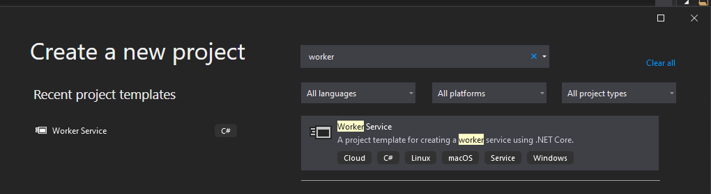
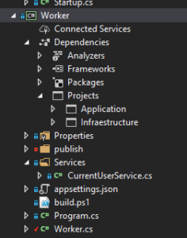
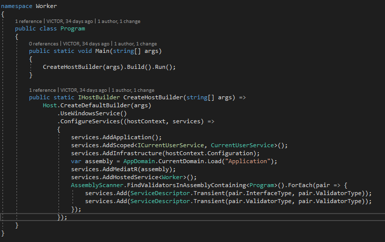
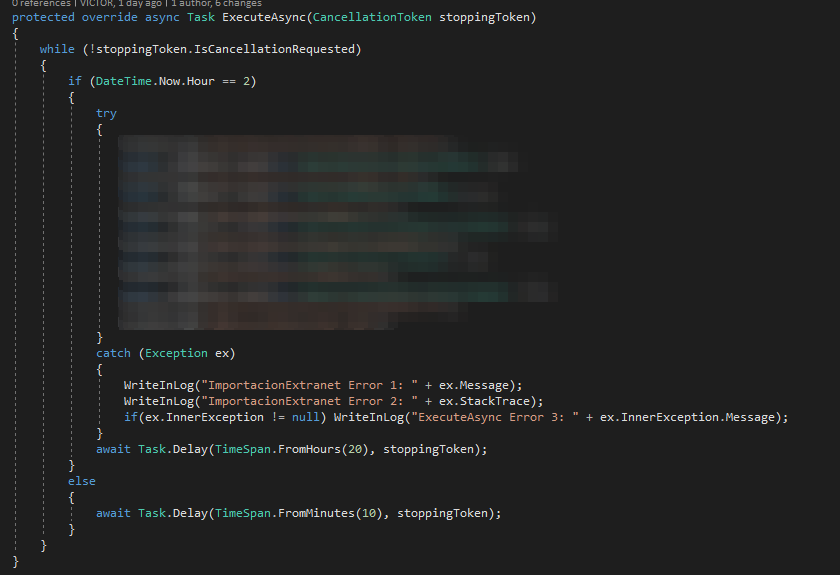

### Primera parte

Hace un tiempo os expliqué [**cómo crear una nueva solución basada en Clean Architecture con .NET Core**](/archive/clean-architecture-con-net-core/). Sin complicaciones excesivas ni rigideces antiproductivas. Intentando obtener un equilibrio entre limpieza y mantenibilidad, por un lado, y rapidez de desarrollo y puesta en marcha, por el otro. Y estaba basada en un ejemplo real, que era el portal corporativo de mi empresa, [**Segula Technologies Spain**](https://spain.segulatechnologies.com/es/). Esta solución, en el monento en que escribí el post, contaba con acceso a su BBDD (SQL Server), interfaz con otros sistemas (el de gestión de personas y ERP, concretamente, para consulta, importación y exportación de datos) y una interfaz de usuario estilo web. Sin embargo, y como suele ocurrir, recientemente hemos necesitado incluir una nueva funcionalidad. Nos dimos cuenta de la necesidad de crear un proceso background que cada día (o mejor dicho, cada noche) importara datos masivos del ERP. El típico proceso batch nocturno, vaya.

### Enfoque de la solución

Si algo teníamos claro, es que no podíamos reproducir el mismo *modus operandi* que se había utilizado hasta ahora en el departamento de desarrollo. Con multitud de proyectos, tareas programas, scripts y demás por ahí sueltos, sin poder saber de una forma rápida y sencilla qué, cómo y cuándo se estaba ejecutando sobre los servidores y las bases de datos en cada momento. Hay varias alternativas para salir de esas prácticas, pero por preferencia personal, más que nada, me interesé por crear un nuevo módulo en la solución que se desplegará como servicio de Windows en el mismo servidor donde se despliega la aplicación web en IIS. De esta forma conseguimos tener todo en el mismo servidor, no necesitamos instalar ningún framework ni app de terceros ni nada por el estilo, y podemos buscar y consultar las diferentes partes de la solución de forma intuitiva. Es decir, si queremos mirar algo de la aplicación web, vamos al IIS, y si queremos mirar algo del servicio background, vamos a los servicios de Windows. Otra ventaja de esta elección es que nos permite tener todo en la misma solución de .NET Core. En este caso como un nuevo proyecto de tipo [**Worker Service**](https://www.fixedbuffer.com/worker-service-como-crear-un-servicio-net-core-3-multiplataforma/).

### Al lío

Pues eso, a lo importante. Veamos cómo he creado este nuevo módulo o parte de la solución respetando (creo) las directrices del modelo Clean Architecture. Dentro de este modelo, esta nueva capa, módulo o parte, como la queramos llamar, tiene una posición periférica, exactamente igual que la de la capa de Presentación. Es decir, para la arquitectura, es prácticamente igual que el proyecto sea de tipo web o de tipo servicio. Se trata de una capa externa que hace uso de la capa de Aplicación.  Si recordáis, la capa de Aplicación era la que se encargaba de la lógica de la aplicación. Es por eso que la capa de Presentación se limitaba a llamar a esta capa para obtener los datos solicitados por el usuario y a volver a llamar a esta capa para realizar cambios sobre los datos de la aplicación. Esto es, sobre los objetos del Dominio. Al igual que la capa de Presentación sólo hace uso de la capa de Aplicación, este tipo de servicios se considera parte de la capa de Presentación o su hermana (casi) gemela. Como os he comentado, opté por crear un Worker Service, ya que forma parte del Framework .NET Core, como el resto de la solución, y, al ser un proyecto que hace uso exclusivamente del proyecto de Aplicación, me permite dejar el resto de la solución tal como estaba.  En este proyecto hay tres ficheros clave: appsettings.json, Program.cs y Worker.cs. 

#### appsettings.json

En este fichero, al igual que el fichero del mismo nombre del proyecto de Presentación (en mi caso de Razor Pages), deberás indicar las bases de datos de las cuales hace uso la solución entera. Esto lo explica mejor [**Jason Taylor**](https://jasontaylor.dev/clean-architecture-getting-started/), pero resumiendo, para hacer uso de la inyección de dependencia, nos vemos obligados a incluir el proyecto de Infraestrucura en nuestos proyectos de Presentación, así como la configuración de acceso a las bases de datos. Mal menor.

#### Program.cs

Aquí se configura nuestro servicio y podemos decir que es como el Program.cs y el Startup.cs del proyecto de Razor. Es decir, aquí vamos a añadir todas las dependencias del proyecto. Es aquí, por tanto, donde le indicamos que añada la implementación del servicio CurrentUserService (que será distinta de la del proyecto Razor), la funcionalidad de MediatR y la de los validadores de la capa de Aplicación (FluentValidation). 

#### Worker.es

Este fichero es el que contiene las llamadas a las queries y comandos de MediatR implementados en capa de aplicación. Como ya hemos configurado la inyección de dependencia, estas llamadas se implementan de igual forma que en el proyecto de Presentación.  Tip final: Como en mi caso quiero que el proceso de importación se ejecute diariamente a la misma hora (más o menos) le he añadido unos delays para que el servicio no esté constamente ejecutando el mismo bucle hasta que toque una nueva ejecución. Como sé que el proceso en ningún caso va a durar más de 4 horas, pongo un delay de 20 horas y a partir de ahí le dejo que, cada 10 minutos, compruebe si ya toca ejecutar el proceso batch de nuevo. Y eso es todo. Espero que, si has seguido este tipo de arquitectura para desarrollar tu proyecto .NET y te haya surgido la misma necesidad, te haya sido de ayuda para desarrollar esta nueva funcionalidad de forma integrada, sencilla y ágil.
