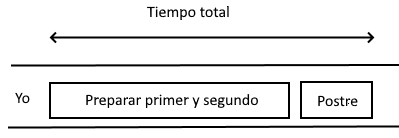
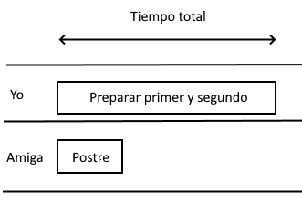

### Definición y diferencia entre estos tres términos

Antes de nada, me gustaría aclarar la definición de asincronicidad, concurrencia y paralelismo, pues considero que pueden ser complejos y que, en no pocas ocasiones, se utilizan erróneamente.

#### Asincronía

Más que asincronía, que para algunos/as puede sonar un poco raro, lo que solemos utilizar frecuentemente es el término síncrono o asícrono, refiriéndonos normalmente a si una llamada o instrucción es síncrona o asíncrona. Pero vayamos al grano... ¿Qué significa que una llamada sea síncrona o asíncrona? **Si una intrucción se ejecuta de manera síncrona, se ejecuta de manera secuencial**, y por tanto debe acabar antes de que comience la siguiente instrucción. Es decir, una instrucción síncrona supone que el programa que la ejecute quede bloqueado hasta que la instrucción termine. **Una instrucción asíncrona, sin embargo, se ejecuta de manera independiente en términos temporales a las siguiente instrucciones o líneas de un código determinado**. Es decir, el programa realiza esa llamada asíncrona y pasa a la siguiente instrucción sin esperar a que acabe la instrucción asíncrona. Ejemplo de código síncrono:

```
Console.WriteLine("Instrucción 1");
Console.WriteLine("Instrucción 2");
Console.WriteLine("Instrucción 3");
```

El resultado será:

```
Instrucción 1
Instrucción 2
Instrucción 3
```

En cambio, un ejemplo de cógido con llamadas asíncronas sería:

```
Console.WriteLine("Instrucción 1");
Task task = Task.Run(() => {
    Thread.Sleep(1000);
    Console.WriteLine("Instrucción 2");
});
Console.WriteLine("Instrucción 3");
task.Wait();
```

El resultado en este caso será:

```
Instrucción 1
Instrucción 3
Instrucción 2
```

#### Concurrencia

Seguramente la diferencia más difícil de ver y entender es la existente entre concurrencia y paralelismo. Muchas veces se utilizan indistintamente para referirnos a códigos que se ejecutan al mismo tiempo. Pero no es así y, a nivel de programación, es muy importante saber diferenciarlos. Voy a intentar explicarlo lo mejor que pueda. Para mí, concurrencia es lo que hacemos normalmente cuando cocinamos. Nosotros somos una única persona, pero hacemos varias cosas al mismo tiempo (gracias a recursos externos). Me explico. Primero, por ejemplo, cortamos varias verduras y hortalizas y las ponemos en la sartén para hacer el sofrito. Mientras la sartén hace su trabajo (aquí viene la concurrencia), nosotros vamos troceando el pollo para ponerlo en el horno. Cuando terminamos de trocearlo, lo ponemos en el horno y esperamos a que tanto las verdudas como el pollo terminen de cocinarse. Cuando esto ocurre, juntamos todo en la olla, echamos un poco caldo, removemos un poco y ponemos todo en la fuente para presentarlo a la mesa. En este caso, hay una única persona (thread/hilo) implicada, pero mientras espera a que una tarea se realice (rehogar las verduras), me pongo con otra (cortar el pollo y ponerlo en el horno), y cuando esas tareas concurrentes terminan, hago otra tarea con ese resultado. ¿Cómo quedaría esto en programación? Nuestra sartén, horno y olla, en este caso, son los recursos externos de los que hacemos uso: bases de datos, cachés, disco duro, servicios web externos, etc. De manera que, **mientras mi código espera a que una consulta de base de datos termine, por ejemplo, queda libre para hacer otra cosa. Cuando la consulta termine, podré seguir con el código dependiente del resultado de esa consulta, pero mientras, probablemente, pueda ir haciendo otra cosa.** Más delante explicaré la importancia de este concepto y de saber diferenciarlo muy bien del de paralelismo para optimizar al máximo nuestros recursos.

#### Paralelismo

**En lo concerniente a programación, el paralelismo se refiere a ejecutar dos códigos diferentes, dos series de instrucciones, al mismo tiempo. En paralelo, a la vez.** De hecho, si no existe ningún tipo de bloqueo entre ellas, se pueden ejecutar de forma completamente independiente. Siguiendo con el ejemplo de la cocina, aquí la situación cambiaría en que, en lugar de ser yo sólo/a la que cocina, en este caso recibo la ayuda de una amiga que, mientras yo cocino el primer y segundo plato, ella hace el postre. Si no nos bloqueamos en ningún momento (por ejemplo, si no necesitamos utilizar el horno al mismo tiempo con intensidades diferentes), el tiempo total invertido en cocinar la comida será el del que tiene la tarea más larga (cocinar primero y segundo, por ejemplo). Mientras que si lo hiciera todo yo sólo o lo hicieramos uno después del otro (porque la cocina es demiado pequeña para estar los dos a la vez, por ejemplo), el tiempo total necesario para realizar la comida sería la suma del necesario para preparar el primero, el segundo y el postre. Como se suele decir, una imagen vale más que mil palabras. Sin paralelismo:  Y con paralelismo:  Quiero hacer notar el hecho de que en el segundo caso hemos participado dos personas en lugar de una 🧐. Cuidado con considerar el paralelismo la panacea... Hablaremos de ello más abajo 😉.

### Características de cada tipo de llamada

Aunque la mayoría de los siguientes consejos aplican para cualquier lenguaje de programación, vamos a centrarnos en .NET. Entonces... **¿Cuándo utilizar en .NET código síncrono/secuencial, concurrente o paralelo?** Y es que, si nos fijamos, estas posibilidades son las que nos quedan, ya que podemos ejecutar código secuencial o asícrono. Pero en el caso de este último, podemos optar por la vía de la concurrencia o el paralelismo.

#### Código secuencial

Sin duda el más fácil de entender y de aplicar. **Es el código que normalemente programamos**, y como veremos, esto no tiene nada de malo. Las **características** del código síncrono o secuencial son:

-   **Las instrucciones se ejecutan una después de otra**. Hasta que no termina la anterior, no comienza la siguiente.
-   **El código es bloqueante**, es decir, el programa bloquea el hilo de ejecución en el cual esta corriendo y no lo suelta hasta que termina.
-   **Utiliza un único hilo de ejecución**. Esto parece baladí, pero es importante, como veremos más adelante.

#### Código concurrente

Este tipo de código se ha popularizado enormemente en los últimos años en .NET gracias que Microsoft introdujo varios cambios que facilitaron enormemente su uso. Estoy hablando d**el famoso async/await**. Si no conoces de que va todavía, te recomiendo encarecidamente que aprendas a utilizarlo a través de artículos como éste: [**https://docs.microsoft.com/es-es/dotnet/csharp/programming-guide/concepts/async/**](https://docs.microsoft.com/es-es/dotnet/csharp/programming-guide/concepts/async/) No obstante, más adelante en el artículo explico un poco más esta herramienta de .NET porque sin duda se trata una de últimas *joyas de la corona* que nos ofreció .NET standard y que se ha convertido en poco menos que obligatorio en .NET Core. Éstas con las **características** de este tipo de código:

-   Normalmente consiste en una serie de instrucciones tanto síncronas como asíncronas. Pero **siempre debe haber al menos una llamada asíncrona**.
-   Si para el código en cuestión una llamada asíncrona debe terminar antes de la siguiente instrucción, **.NET puede liberar el hijo de ejecución de ese programa y volver a coger ese u otro hilo cuando dicha llamada acabe.** Por ejemplo, si hacemos una consulta sobre base de datos, no tiene sentido que bloqueemos un core de nuestro procesador si no estamos haciendo nada. Como te comentaba antes, estaté tranquilo/a, lo explico mejor en el siguiente apartado del artículo.
-   En caso de que el proprio código/programa pueda hacer algo mientras espera a que se complete la llamada asíncrona (la consulta de BBDD, por ejemplo), **puede seguir ejecutando instrucciones y así ahorrar tiempo.**
-   Al igual que el código secuencial, **utiliza un único hilo de ejecución**, sólo que con la ventaja de que sólo lo utiliza cuando realmente lo necesita y con la posibilidad de realizar varias tareas a la vez.

#### Código en paralelo

**Se trata del código más rápido** cuando una tarea puede ser dividida en subtareas diferentes a nivel de código. Pero... ¡OJO! Debe ser utilizado con mucho cuidado. ¿Por qué? Pues porque para ejecutar dos tareas en paralelo necesitas dos hilos de ejecución diferentes, dos threads. Y esto... ¿Qué significa? Pues significa que, **para que esa tarea que has dividido en dos subtareas vaya más rápido, estás utilizando más CPU**. Para que nos entendamos, y simplificando un poco, estás utilizando dos cores de la CPU. Uno para cada tareas que ejecutas en paralelo. Y claro, esto no es siempre deseable puesto que, en un servidor web, por ejemplo, cada request se ejecuta en su thread, y por tanto requiere un core para ejecutarse. Entonces, si en una misma request requieres de varios cores, estás dejando menos cores libres para el resto de requests y esto puede ralentizar el sistema y la capacidad del mismo para resolver las requests según llegan. Por tanto, el paralelismo no vale para todos los casos. De hecho, **suele ser realmente útil sólo en unos casos determinados**. ¿En cuáles? Lo explicaré en breve. De momento, vamos a ver las **características** principales del código paralelo:

-   **El código se ejecuta en diferentes hilos que ejecutan series de instrucciones en paralelo, o sea, a la vez**. Sin alternarse como el caso de la concurrencia.
-   El código **utiliza tantos cores como threads crees** para la ejecución del código.
-   **Si creas un nuevo hilo de ejecución con una llamada asíncrona, el thread principal (el llamador) será liberado** hasta recibir una respuesta del thread que has creado desde el principal.

### La estrategia a seguir en .NET.

Probablemente lo hayas deducido ya, pero si no, ya te lo digo. En .NET, **el enfoque async/await se ha convertido no sólo en un estándar, sino que se lo considera *la joya de la corona* de las últimas versiones de .NET y de .NET Core**. Casi todos los modelos o templates de arquitectura se basan en llamadas de este tipo porque facilitan sobremanera el uso de código concurrente allí donde sea posible. Y, si, pensamos un poco, en la gran mayoría de aplicaciones las peticiones son susceptibles de ejecutarse de manera asíncrona. En las aplicaciones en las que has colaborado, fueran de tipo escritorio, web, mobile, backend... ¿suele haber algún tipo de dependencia sobre un elemento externo (base de datos, servicio web externo, acceso a disco, etc.)? Seguramente la respuesta es que sí. En las aplicaciones de escritorio, además, existe la necesidad de bloquear lo mínimo posible la interfaz para optimizar la experiencia de usuario. Esto hace de que este patrón sea adoptado por defecto. ¿Que necesito ejecutar códigoi síncrono? Pues **no bloqueo CPU cuando estoy parado**. ¿Qué necesito ejecutar código concurrente? Fácil, **no tengo que hacer nada complejo**. Simplemente no hago la llamada con el await (o aplazo el uso del await).

#### Enfoque async/await

Este enfoque es muy sencillo, y únicamente requiere unos cambios muy simples sobre el código síncrono para convertirlo en asíncrono. Como ya he comentado antes, el objetivo de este artículo es explicar la ventaja de este enfoque, no explicar cómo llevarlo a la práctica concreta. Pero un veamos un pequeño ejemplo. **El *async* se utiliza como modificador en la cabecera de un método** para indicar que puede ser llamado de manera asíncrona. Éstos métodos además, **suelen retornar un tipo Task**, en lugar de un tipo de dato concreto directamente. Otra caracterísica de estos métodos, es que **deben hacer una llamada con *await***. De ahí el nombre del enfoque. **Esta llamada *await* es la que está asociada al uso de un recurso externo** para el cuál hay que esperar cierto tiempo hasta obtener respuesta. .NET ya ofrece muchos métodos con el sufijo Async que pueden ser llamados con la palabra clave await (para acceso a BBDDs o ficheros, por ejemplo). Un ejemplo básico sería éste (extraído de **[aquí](https://docs.microsoft.com/es-es/ef/ef6/fundamentals/async)**):

```
public static async Task PerformDatabaseOperationsAsync()
{
    using (var db = new BloggingContext())
    {
        db.Blogs.Add(new Blog
        {
            Name = "Test Blog #" + (db.Blogs.Count() + 1)
        });
        await db.SaveChangesAsync();
        var blogs = await (from b in db.Blog orderby b.Name select b).ToListAsync();
        foreach (var blog in blogs)
        {
            Console.WriteLine(" - " + blog.Name);
        }
    }
}
```

La gracia de todo esto, además, radica en que este tipo de enfoque se aplica *en forma de cadena*, de manera que el método que llame a *PerformDatabaseOperationsAsync()* lo haga también con *await* y tenga en su cabecera la palabra clave *async*. Te recomiendo ponerlo en práctica, y verás como lo coges enseguida 😉. **Las llamadas paralelas, en cambio, se suelen hacer con el método estático Task.Run**. Como argumento puedes utilizar código o un método. Un ejemplo muy sencillo podría ser el siguiente (extraído de **[aquí](https://www.pluralsight.com/guides/using-task-run-async-await)**):

```
await Task.Run(() =>
{
    for (int i = 0; i < int.MaxValue; i++)
    {
        ...
    }
});
```

#### Cuándo utilizar async/await y cuándo utilizar Task.Run

Otra forma de plantearlo sería... ¿Cuándo utilizar concurrencia y cuando paralelismo? Un inciso antes. En .NET ahora de forma casi unánime, se usa el enfoque async/await aunque no se utilice una estrategia de concurrencia en un código concreto, en la propia llamada. Me explico. **Puede que todas tus llamadas se hagan de manera secuencial y cada instrucción siempre espere antes de ejcutarse a que termine la ejecución de la anterior pero, cuando el código haga una llamada a un recurso externo para el cuál debe esperar a obtener una respuesta, el thread, el core, quedará liberado para que otra petición pueda hacer uso del mismo. En términos de optimización de uso de CPU, por tanto, el enfoque async/await es SIEMPRE buena idea.** Pero este enfoque, además, nos permite ejecutar nuestras subtareas de manera concurrente, haciendo que los tiempos de respuesta se reduzcan. Dicho esto, vayamos al grano. ¿Cuándo utilizar un enfoque y cuándo otro? Si atendemos a la naturaleza de **la mayoría de aplicaciones que son desarrolladas actualmente, el enfoque por defecto va a ser el del async/await**, el de la concurrencia. ¿Por qué? Pues porque en la mayoría de nuestras peticiones, gran parte del tiempo de respuesta viene determinado por el tiempo de respuesta de uno o varios recursos externos. **Se trata de código de tipo I/O-Bound.** Aquí, la mejor estrategía es aprovechar esos lapsos para intentar ejecutar varias peticiones de manera simultánea. Un ejemplo sería un método de la capa de lógica de aplicación que necesita obtener varios datos de manera independientes (varias consultas SQL) y después, con esos datos, crear un DTO para retornarlo. Entonces, **¿cuándo utilizamos paralelismo?** ¿Cuándo hacemos uso de Task.Run? Pues en esas ocasiones en las que has creado un algoritmo de los *de aúpa*. Una de esas obras maestras de programación, que tienen casi más de matemáticas y lógica que de programación per se. Es **el denominado código CPU-bound.** Código que hace un uso mucho mayor de CPU que de acceso tipo I/O. Las lógicas complejas de recursividad, por ejemplo, pueden ser buenas candidatas. Sin embargo, **en la mayoría de aplicaciones, este código suele ser la excepción, no la norma**. Y la mayoría de arquitecturas modernas basadas en .NET priorizan (aunque no de manera exclusiva), el uso del enfoque async/await. Por tanto, como recomendación general, siempre que sea posible, **define tus métodos como async en la cabecera y tus llamadas con await**. Eso sí, siempre que puedas hacer uso de concurrencia, hazlo, utilizando por ejemplo la opción de WhenAll para obtener los datos necesarios antes de continuar con las instrucciones siguientes. Sólo en aquellos casos en los que te puedas beneficiar de paralelismo y tengas código de tipo CPU-bound, crea nuevos threads que optimicen una petición concreta. Sobre todo, **el aspecto a evitar es crear varios threads para hacer operaciones de tipo I/O-bound**, ya que no va a ofrecer prácticamente ninguna ventaja sobre la concurrencia y, además, estarás malgastando CPU.
