### La capa de presentación en Clean Architecture

En el [**post en el que explicaba como crear una solución de Visual Studio basada en el modelo Clean Architecture**](/archive/clean-architecture-con-net-core/) propuesto por [**Jason Taylor**](https://jasontaylor.dev/), han aparecido alguna dudas en los comentarios. Una de ellas, era sobre cómo implementar una interfaz basada en Blazor sobre esta solución. Me parece que esta duda puede ser bastante común, y que además, probablemente, no la respondí de forma profunda. Así que, tal y como me pidió esa persona, voy a explicar todos los pasos y detalles necesarios para integrar un proyecto de presentación basado en Blazor en nuestra solución Clean Architecture.

### Crear el proyecto Blazor en nuestra solución

Si no lo has hecho todavía, el primer paso es tener creada la solución basada en Clean Architecture con todas las tecnologías propuestas por Jason. Puedes encontrar un proyecto esqueleto en su [**Github**](https://github.com/jasontaylordev/CleanArchitecture). El bueno de Jason utiliza una capa de presentación basada en [**Angular**](https://angular.io/). Si no conoces esta tecnología, te recomiendo echarle un vistazo. Yo me estoy formando en ella y tiene *pintaza*. Una vez tenemos la solución disponible, es hora de incorporar nuestro proyecto Blazor a la solución. Para ello, hacemos el típico de proceso de nuevo proyecto, escogemos la opción de Blazor y lo creamos bajo la carpeta src. Yo lo creé con el nombre de WebMobileUI porque este proyecto es la interfaz web para acceso móvil de nuestra Extranet. 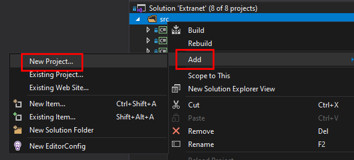 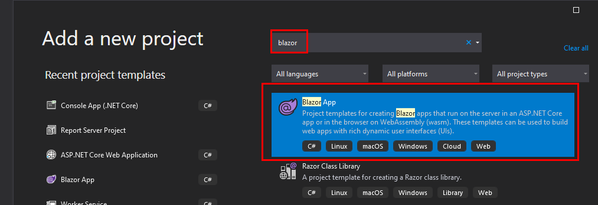 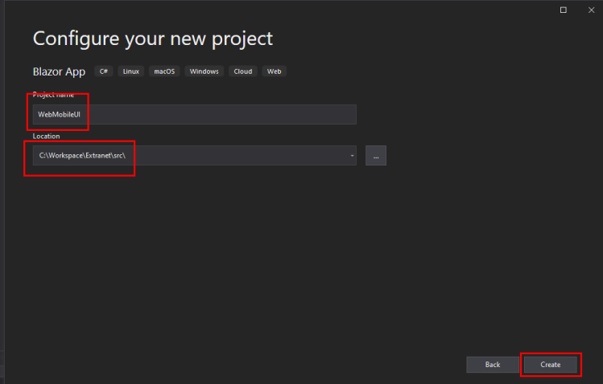 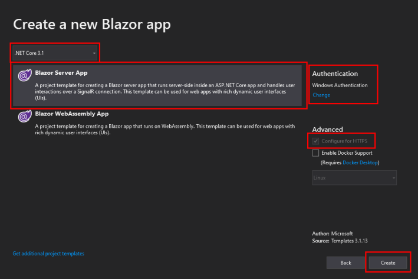 En la última pantalla, como veis, yo he escogido las opciones de Blazor Server y Autenticación de Windows, pero eso ya depende mucho de vuestro proyecto particular.

### Integrar el proyecto con el resto de la solución

Aquí viene lo realmente importante. Espero no dejarme nada, pero si es así, no dudéis en hacérmelo saber en los comentarios ;-). En **Packages**, debemos añadir el paquete FluentValidation.AspNetCore, para poder hacer uso de esta tecnología que hemos incorporado en otros proyectos de la solución. 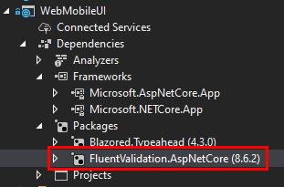 En **Projects**, como en cualquier otro proyecto de presentación, debemos incluir las referencias a los proyectos Application e Infraestructure. 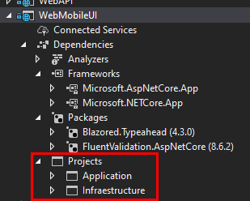 En **Programs.cs**, para poder hacer uso de la funcionalidad de Entity Framework Core que nos permite migrar la base de datos al iniciar el programa, incluimos las siguientes líneas marcadas en rojo: 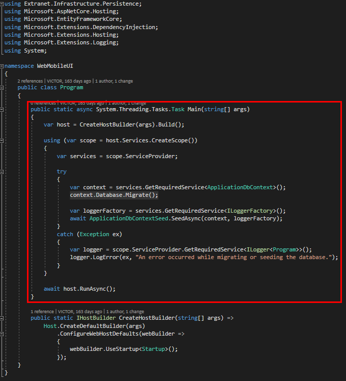 Puedes descargar este fichero haciendo click [**aquí**](https://www.victorgomezdejuan.com/wp-content/uploads/2021/02/Program.zip). Otro fichero que debemos modificar es **Startup.cs**, añadiendo las líneas marcadas en rojo: 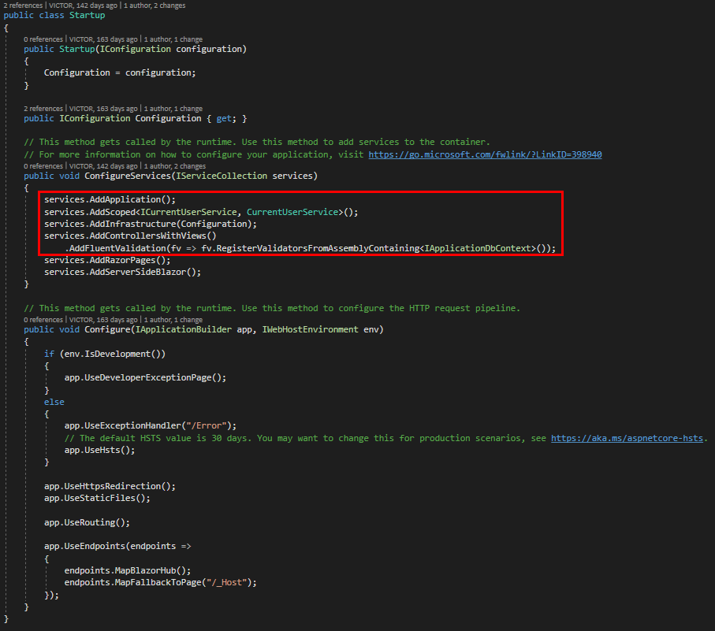 El siguiente fichero a modificar será **\_Imports.razor**, donde incluiremos las referencias a MediatR para poder llamar a los comandos y queries de la capa de Aplicación desde nuestros ficheros .razor. 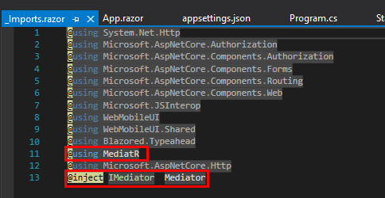 Gracias a esto, en los ficheros .razor, únicamente tenemos que hacer un *include* de la clase del comando o query que queremos y llamar a esa clase con la gramática estándar: 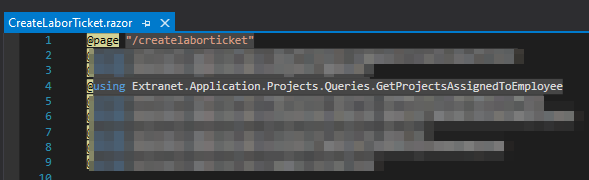 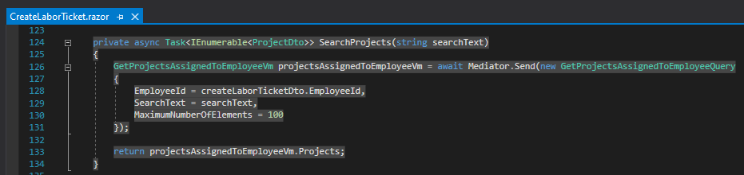 ¡Y listo! Ya tienes tu proyecto Blazor completamente integrado en tu solución basada en Clean Architecture 😉. Espero que te sea de ayuda.
