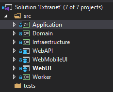
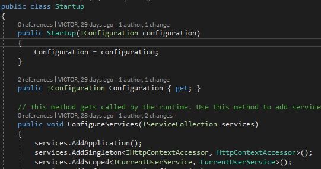
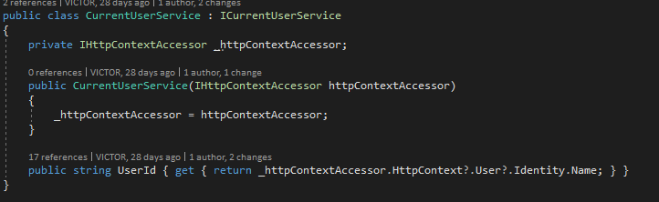
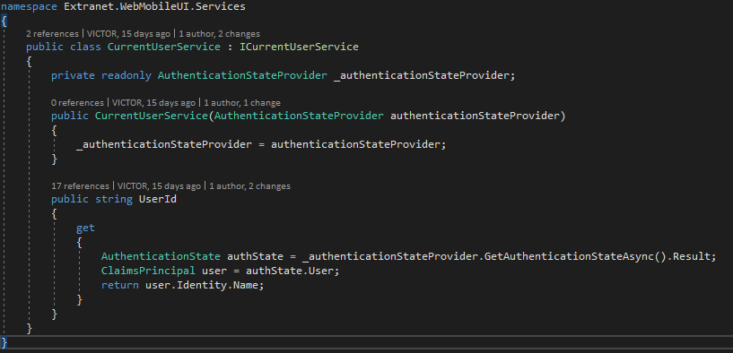
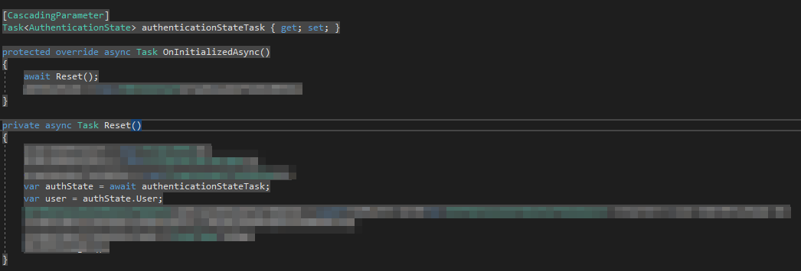

### Blazor como interfaz de usuario

Si has leído [**los posts anteriores**](/archive/clean-architecture-con-net-core/) sobre cómo desarrollar una solución software basada en **Clean Architecture con .NET Core**, habrás visto que, como tecnología para la interfaz de usuario, escogí [**Razor Pages**](https://docs.microsoft.com/es-es/aspnet/core/razor-pages/?view=aspnetcore-3.1&tabs=visual-studio).

La elección de esta tecnología se debía a mi conocimiento previo con ella y que la aplicación iba a contener pantallas y contenidos muy diferentes. Sin embargo, recientemente nos ha surgido la necesidad de crear una versión web para móviles que tendrá una funcionalidad distinta a la de la aplicación web normal basada en **Razor**.

Su función será facilitar la realización de consultas y operaciones sencillas para aquellos usuarios que no tengan disponible un PC/portátil en ese momento. Después de darle unas vueltas, vimos que la mejor opción era optar por una [**SPA (Single Page Application)**](https://es.wikipedia.org/wiki/Single-page_application) que facilitara el el uso y optimizara el rendimiento.

De ahí la necesidad de crear un nuevo proyecto en la solución para implementar la aplicación web para su acceso desde móviles.

La solución por el momento, queda así:

**Application, Domain e Infraestructure** son los proyectos de las capas que expliqué [**en el primer post**](/archive/clean-architecture-con-net-core/).

**WebAPI** es el proyecto que alberga los servicios webs ofrecidos por la extranet.

**WebMobileUI** es el proyecto [**Blazor**](https://dotnet.microsoft.com/apps/aspnet/web-apps/blazor).

**WebUI** es el proyecto **Razor Pages**.

[**Worker**](/archive/anadir-servicio-de-windows-en-clean-architecture-con-net-core/) es el proyecto que contiene las tareas programadas que se ejecutan como **servicio de Windows**.

### Windows Authentication y la interfaz ICurrentUserService

Si habéis utilizado [**el mismo esqueleto que yo**](/archive/clean-architecture-con-net-core/) para implementar vuestra solución Clean Architecture con .NET Core, es decir, [**la que propone Jason Taylor**](https://github.com/jasontaylordev/CleanArchitecture), en cada proyecto de interfaz o de acceso a la capa de aplicación, habréis tenido que implementar la interfaz ICurrentUserService para que el programa pueda consultar cuál es el usuario actual que esta accediendo al mismo.

Y si habéis integrado estos proyectos con la **autenticación de Windows** de .NET Core (via Active Directory), seguramente habréis utilizado el servicio IHttpContextAccessor que se incluye en la clase Startup.cs. Nosotros hemos hecho uso de esta herramienta tanto en el proyecto de [**Razor Pages**](https://docs.microsoft.com/es-es/aspnet/core/razor-pages/?view=aspnetcore-3.1&tabs=visual-studio) como en el de la [**API REST**](https://www.bbvaapimarket.com/es/mundo-api/api-rest-que-es-y-cuales-son-sus-ventajas-en-el-desarrollo-de-proyectos/).

Pero esta solución no sirve para un proyecto Blazor Server, que es el que nosotros hemos utilizado.  En este caso, hemos implementado la interfaz ICurrentUserService haciendo uso del servicio AuthenticationStateProvider de la siguiente forma:

Y, para obtener el usuario actual dentro de una página blazor (fichero .razor), hemos incluido un *CascadingParameter* de tipo *Task.*

Con esto cubríriamos las necesidades de autenticación y de seguridad de la solución y permitimos a la capa de aplicación obtener el usuario que está accediendo a la extranet para sus comprobaciones y consultas.
