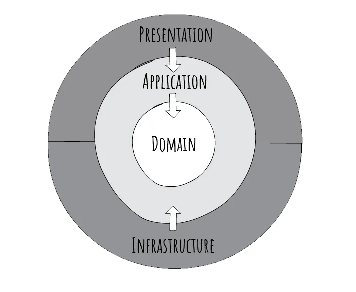

#### Introducción

En [**Segula Technologies**](https://spain.segulatechnologies.com/es/)**, [mi actual empresa](https://www.victorgomezdejuan.com/vida-profesional/)**,  estamos desarrollando una nueva **Intranet/Extranet con tecnología Microsoft**. Los hemos decidido así por el conocimiento previo en desarrollo de software en entorno .NET de los dos miembros del equipo, porque ya teníamos licencias de Visual Studio y porque la mayoría de sistemas y entornos utilizan tecnología de la marca de Redmond. En este post os explico cómo y por qué nos decidimos finalmente por la opción de **Clean Architecture con .NET Core**.

Como suele ser común en estos casos, queríamos que la nueva plataforma fuera **amigable, responsive, escalable y fácil de desarrollar y mantener**. Así que me puse manos a la obra en la búsqueda de una buena arquitectura de software para nuestros requisitos.

Somos un equipo de desarrollo pequeño (dos personas) y no queremos montar una megaplataforma con 500 capas y módulos diferentes. Aún así, esta Intranet va a tener de todo: interfaz web y probablemente app móvil, bastantes apartados diferentes, lógica de negocio de varias áreas diferentes de la empresa, acceso a APIs externas, acceso a bases de datos múltiples, tareas en background y oferta de servicios web a sistemas externos (y probablemente otro tipo de interfaces con otros sistemas que no soporten este tipo de interacción o casos en los que no sea la mejor opción). Si este es tu/vuestro caso, **sigue leyendo** ?.

Después de buscar, indagar y descargarme unos 15 proyectos de esqueleto o demo con diferentes estructuras, me decanté por la propuesta **[*Clean Architecture with .NET Core*](https://jasontaylor.dev/clean-architecture-getting-started/)**  de [**Jason Taylor**](https://github.com/jasontaylordev). Las demás, o se quedaban cortas, o no cumplían con ciertos criterios de separación de responsabilidades entre capas o eran monstruos más bien para el escaparate académico. La propuesta de Jason no es excesivamente sencilla de entender, pero gracias a sus artículos, vídeos, los dos proyectos de ejemplo que tiene y un poco de tiempo y esfuerzo lo acabas entendiendo. Y **es relativamente fácil comenzar a picar código partiendo del proyecto esqueleto**.

La propuesta de arquitectura de Jason realmente consigue un equilibro bastante reseñable en cuanto a limpieza de código, agilidad de desarrollo, modularidad, escalabilidad y mantenibilidad. Si vas a realizar un **proyecto para una PYME o similar**, y no quieres ser un aportador más del código "churro" inmantenible que hemos heredado (y en algunos casos seguramente creado, por que no) muchos de nosotros, te recomiendo estudiar esta opción.

#### En qué consiste

Resumiendo mucho, **Clean Architecture** se basa en la idea de que la capa de dominio no dependa de ninguna capa exterior. La de aplicación sólo depende de la de dominio y el resto (normalmente presentación y acceso a datos) depende exclusivamente de la capa de aplicación (no tienen acceso a la capa de dominio directamente). Todo esto lo consigue de forma muy hábil con la implementación de interfaces de servicios que luego tendrán que implementar las capas externas y ya la popular [**inyección de dependencias**](https://es.wikipedia.org/wiki/Inyecci%C3%B3n_de_dependencias).

#### Ventajas que ofrece

Jason Taylor cita algunas más, pero yo me quedo con éstas:

-   **Independiente del tipo de UI (Interfaz de Usuario)**.  Al estar toda la lógica fuera de la capa de UI, podemos utilizar la tecnología que queramos. O incluso, como probablemente sea nuestro caso, utilizar más de una (una para acceso web desde PC/portátil y otra para acceso desde smartphone).
-   **Independencia de la base de datos**. Esto es algo que se supone que ya nos lo proporciona [**Entity Framework**](https://www.entityframeworktutorial.net/what-is-entityframework.aspx) y me gusta el hecho de que Jason tampoco se complique mucho el tema con esto por esa misma razón.
-   **Independiente de todo lo externo al proyecto/aplicación**. Esto siempre se dice de forma grandilocuente y luego nunca suele ser verdad, pero es cierto que la modularidad, la gestión de dependencias y el hecho de basarse en .NET Core hace que esta opción sea una de las que más se acerce a tan atrevida afirmación.

También está como ventaja reseñable la posibilidad de sistematizar el tema del **testing**, pero es algo que nosotros de momento no vamos a implementar y la experiencia me dice que esto suele ser lo común.

#### Tecnologías y frameworks utilizados

Sin duda una de las joyas de la corona de la propuesta Clean Architecture de Taylor es el uso que hace de frameworks y tecnologías sin caer en el purismo ni en el uso alocado de estas herramientas. Utiliza fundamentalmente las siguientes:

-   **[MediatR](https://github.com/jbogard/MediatR)**. Para la llamada de servicios a la capa de aplicación sin hacer uso de dependencias. Me ha parecido superútil no sólo para evitar el tema de dependencias, si no sobre todo para estructurar las llamadas de queries (consulta) y comandos (inserción/modificación/borrado) de manera fácilmente entendible, desarrollable y mantenible.
-   **[FluentValidation](https://fluentvalidation.net/)**. Permite "aislar" las validaciones de los comandos para tenerlas en un único sitio y ahorrarse mogollón de código. Durante algunos momentos me asusté porque creía que no iba a poder hacer algunos tipos de validación con esta herramienta, pero con un poco de tiempo, esfuerzo y la ayuda de esa buena gente que publica soluciones a problemas complejos, de momento he conseguido hacer de todo.
-   **[AutoMapper](https://automapper.org/)**. Para sistematizar la conversión de objetos de modelo en [**view models**](https://en.wikipedia.org/wiki/Model%E2%80%93view%E2%80%93viewmodel) de una manera fácil, ahorrándose código y sabiendo donde encontrarlo cuando lo buscas.
-   [**Entity Framework Core.**](https://docs.microsoft.com/en-us/ef/core/) El Framework para acceso a datos estándar de .NET Core. Conocido por tod@s, seguramente.
    

Dependiendo de tus necesidades utilizarás alguna más. En mi caso por ejemplo de momento [**Razor Pages**](https://www.learnrazorpages.com/) para la interfaz de usuario. Jason Taylor implementa algunas en sus proyectos de ejemplo.

#### ¿Por dónde empezar?

Buena pregunta. Yo cuento qué orden seguí más o menos, y cada uno ya veréis si os vale o no.

1.  Presentación de Jason Taylor en 2018. **[Clean Architecture with ASP.NET Core 2.1](https://www.youtube.com/watch?v=_lwCVE_XgqI&feature=youtu.be)**
2.  Otra presentación posterior del bueno de Jason en 2019. [**Clean Architecture with ASP.NET Core 3.0**](https://www.youtube.com/watch?v=5OtUm1BLmG0&feature=youtu.be)
3.   Descargarse los proyectos Clean Architecture (casi esqueleto sólo, pero más nuevo) y Northwind Traders del **[GitHub de Jason](https://github.com/jasontaylordev)** y echarles un vistazo con visto en los vídeos.
4.  El típico **[Getting Started](https://jasontaylor.dev/clean-architecture-getting-started/)**.
5.  Encontré muy útil también **[este artículo](https://alexcodetuts.com/2020/02/05/asp-net-core-3-1-clean-architecture-invoice-management-app-part-1/)**. El Getting Started desde alguien que no sea el propio Taylor.
6.  Y por último, **[este artículo](https://github.com/GFoley83/CleanArchitecture/commit/abe8c74c5fc010c74df5d3ac4256d8aef18b8493)**, si como nosotros quieres añadir validación por roles (la autenticación la hacemos via [**Active Directory**](https://es.wikipedia.org/wiki/Active_Directory)).

¡Ánimo! Si tienes cualquier consulta puedes dejar un comentario y lo intentaré contestar con la mayor brevedad.

#### Información adicional

Quizás pueda ser de tu interés alguno de los artículos que he escrito posteriormente relacionados con este post:

[**Añadir Servicio de Windows en Clean Architecture con .NET Core**](/archive/anadir-servicio-de-windows-en-clean-architecture-con-net-core/)

[**Clean Architecture con .NET Core, Blazor y Windows Authentication**](/archive/clean-architecture-con-net-core-blazor-y-windows-authentication/)

[**Clean Architecture con Blazor**](/archive/clean-architecture-con-blazor/)
