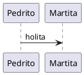
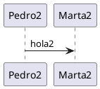

### Documentación técnica: ¿En control de código o en Wiki?

En varios proyectos en los que he colaborado, la documentación es un tema bastante importante. Es cierto que no hay nada tan importante como una buena legibilidad de los tests y del código productivo pero, en ciertas ocasiones, por necesidades del propio equipo o por normativa corporativa, es necesario añadir documentación adicional sobre el código. Cuando esto es un requisito, la solución idónea por parte de los desarrolladores/as suele ser incluir ficheros de texto sencillos (normalmente markdown) en el repositorio donde se sube el código. De esta manera, es más fácil mantener esta documentación a la vez que se mantiene el código y ésta se encuentra muy accesible para los propios programadores/as. Sin embargo, no todo el mundo tiene acceso al repositorio de código, y a veces se requiere un repositorio de documentación común tanto para la parte técnica como para la parte funcional/comercial. Un repositorio único para el proyecto, vaya. Éste es el caso que me encontré hace unos meses, donde estaba trabajando para un proyecto en la que casi toda la documentación se incluía en una wiki [**Atlassian Confluence**](https://www.atlassian.com/software/confluence). Primero era en una versión antigua *on premises* y luego en [**la versión *cloud* oficial actual**](https://www.atlassian.com/software/confluence/free).

### ¿Por qué no elegir las dos?

Entonces, la pregunta que nos surgió en el equipo de desarrollo fue... ¿Y no podemos mantener nuestra documentación técnica (al menos la más básica e importante) en el repositorio de código en ficheros markdown (.md) y que ese contenido se actualice automáticamente como páginas de la wiki? Es decir, lo que queríamos era poder escribir la descripción técnica de los diferentes proyectos (en nuestro caso, microservicios) en ficheros .md y que cada fichero .md se correspondiera con una página específica de la wiki. De esta manera, cada vez que incluyéramos un nuevo fichero en nuestro repositorio de código, se crearía una página en la wiki con ese contenido. De la misma forma, cada vez que actualizásemos uno de esos ficheros, se actualizaría la información en la página de wiki correspondiente. Así, podríamos documentar una única vez, y tener esa información a mano, cerca de código, y a la vez cumplir con el requisito de que toda la documentación del proyecto, técnica o no, estuviera en la wiki del mismo.

### Sincronización de ficheros markdown y Atlassian Confluence

Os explico cómo lo hicimos. A nivel más general, desarrollamos una aplicación de consola .NET que se ejecutara en nuestra pipeline cada vez que una aprobación de *pull request* conllevara la inclusión o actualización de un fichero markdown (extensión .md) del repositorio de código. Lo primero que hace esta aplicación, por tanto, será obtener la lista de ficheros markdown en nuestro repositorio:

```
string[] files = Directory.GetFiles(startup.AppSettings.RepoPath, startup.AppSettings.FilePattern,
        new EnumerationOptions { MatchCasing = MatchCasing.CaseInsensitive, RecurseSubdirectories = true });
```

Un punto importante que probablemente ya habréis pensado es: ¿Cómo sabemos dónde colocar la página en la wiki? ¿Con qué título? Una solución sencilla podría ser definir por ejemplo una página padre a nivel de aplicación, de manera que todas las páginas creadas a partir de ficheros markdown se crearan como hijas de ésta. Y para el título, se podría utilizar el nombre del fichero markdown. Nosotros necesitábamos más flexibilidad, por lo que, siguiendo la misma idea indicada en [**la herramienta Mark**](https://github.com/kovetskiy/mark), lo que hacemos es añadir dos headers en nuestros ficheros markdown:

```
<!-- ParentPageId: 196623 -->
<!-- PageTitle: Microservice 2 -->
```

Llegados a este punto, me parece importante indicar que Mark será seguramente suficiente para la mayoría de interesados/as en este proceso, por lo que probablemente no necesitéis seguir el resto de pasos indicados en este artículo. Nosotros en cambio, teníamos el requisito de no utilizar ninguna herramienta de terceros, y además teníamos que poder incluir diagramas [**PlantUML**](https://plantuml.com/es/) tanto dentro de los ficheros markdown como en la wiki. Volviendo al proceso de la aplicación, vamos procesando uno a uno los ficheros markdown de la lista. Lo primero que hacemos es recoger los metadatos comentados anteriormente (página padre y título). Otro punto importante es que estos *headers* no sólo sirven para obtener esa información, si no que nos ayuda a saber qué ficheros queremos que se incluyan en la wiki (los que contienen *metadata*) y cuáles no.

```
MetaData metaData = MetaDataParser.GetMetaData(file);
```

```
    class MetaData
    {
        public int? ParentPageId { get; set; }
        public string? PageTitle { get; set; }
    }
```

***Aviso**: No incluyo todo el código del proyecto, ya que no tengo ahora mismo tiempo para crear un proyecto aparte con el código compartible y separarlo de lo que no puedo compartir, pero puedes contactarme por LinkedIn o cualquier otro medio, y estaré encantado de pasarte las partes del código que necesites y que pueda compartir.* Lo siguiente que hacemos es realizar la primera llamada a Confluence para saber si la página ya existe en la wiki y, en caso de que exista, comprobar que la fecha de modificación del fichero markdown sea posterior a la fecha de publicación/modificación de la página wiki. En caso de que no exista o de que se haya modificado, el contenido debe ser actualizado en la wiki. Incluyo aquí el código que se encarga de hacer la llamada a la API de Confluence para realizar esta comprobación.

```
public static async Task<PageData?> GetPageDataAsync(AppSettings appSettings, string title)
{
    PageData? pageData = null;
    using (var client = new HttpClient())
    {
        client.DefaultRequestHeaders.Add("Authorization", "Basic " + appSettings.ConfluenceAccessToken);
        HttpResponseMessage response = await client.GetAsync(appSettings.ConfluenceUrl +

quot;/rest/api/content?title={HttpUtility.HtmlEncode(title)}&spaceKey={appSettings.ConfluenceSpace}&expand=version");
        if (response.StatusCode == HttpStatusCode.OK)
        {
            JsonDocument? responseContent = JsonSerializer.Deserialize<JsonDocument>(await response.Content.ReadAsStringAsync());
            if (responseContent is not null)
            {
                JsonElement results = responseContent.RootElement.GetProperty("results");
                int resultsCount = results.GetArrayLength();
                if (resultsCount > 0)
                {
                    string? pageId = results[0].GetProperty("id").GetString();
                    if (pageId is not null)
                    {
                        int pageVersion = results[0].GetProperty("version").GetProperty("number").GetInt32();
                        DateTime updateDate = results[0].GetProperty("version").GetProperty("when").GetDateTime().ToUniversalTime();
                        pageData = new PageData(int.Parse(pageId), pageVersion, updateDate);
                    }
                }
            }
        }
        else
        {
            throw new ConfluenceAPICallException("Error trying to get page " + title + ". Status code: " + response.StatusCode.ToString());
        }
    }
    return pageData;
}
```

Como podéis comprobar, y como seguramente muchos de vosotros/as ya sospechabais, necesitáis **[generar un *access token*](https://confluence.atlassian.com/enterprise/using-personal-access-tokens-1026032365.html)** para acceder a la API de vuestra instancia de Atlassian Confluence. En caso de que la página no exista en la wiki o que debamos actualizarla, lo siguiente que hacemos es convertir el contenido markdown de nuestro fichero, en código HTML. Este tipo de formato es aceptado por Confluence y puede ser enviado directamente a través de API. Hay muchas formas de conseguir esta conversión, pero nosotros (por la restricción de no utilizar librerías o herramientas de terceros) optamos por crear nuestra propia clase parseadora. Podéis descargaros en fichero de la clase [**aquí**](https://www.victorgomezdejuan.com/wp-content/uploads/2022/11/MarkdownConverter.zip). Para ser totalmente sinceros, en realidad el parseador lo que hace es generar código HTML y, para un caso en concreto, el de los diagramas PlantUML (hablo más adelante sobre esto), genera código propio de las páginas de Confluence, que es XML y se puede mezclar con código HTML estándar. Una vez tenemos el contenido del fichero en formato HTML, si la página es de nueva creación, llamaremos a la API de Confluence con el siguiente código:

```
public static async Task<int?> CreatePageAsync(AppSettings appSettings, MetaData metaData, string content)
{
    int? pageId = null;
    object requestBody = new
    {
        type = "page",
        title = metaData.PageTitle,
        ancestors = new[] {
            new { id = metaData.ParentPageId }
        },
        space = new { key = appSettings.ConfluenceSpace },
        body = new { storage = new { value = content, representation = "storage" } }
    };
    using (var client = new HttpClient())
    {
        client.DefaultRequestHeaders.Add("Authorization", "Basic " + appSettings.ConfluenceAccessToken);
        HttpResponseMessage response = await client.PostAsync(
            appSettings.ConfluenceUrl + "/rest/api/content",
            new StringContent(JsonSerializer.Serialize(requestBody), Encoding.UTF8, "application/json"));
        if (response.StatusCode == HttpStatusCode.OK)
        {
            string body = await response.Content.ReadAsStringAsync();
            JsonNode? bodyContent = JsonSerializer.Deserialize<JsonNode>(body);
            if (bodyContent is not null)
            {
                pageId = int.Parse(bodyContent["id"]!.GetValue<string>());
            }
        }
        else
        {
            throw new ConfluenceAPICallException("Error trying to create page " + metaData.PageTitle + ". Status code: " + response.StatusCode.ToString());
        }
    }
    return pageId;
}
```

En caso de la página ya exista, se trataría de realizar una actualización, por lo que la llamada sería así:

```
public static async Task UpdatePageAsync(AppSettings appSettings, string title, string content, PageData pageData)
{
    object requestBody = new
    {
        type = "page",
        title,
        body = new { storage = new { value = content, representation = "storage" } },
        version = new { number = pageData.Version + 1 }
    };
    using var client = new HttpClient();
    client.DefaultRequestHeaders.Add("Authorization", "Basic " + appSettings.ConfluenceAccessToken);
    HttpResponseMessage response = await client.PutAsync(
        appSettings.ConfluenceUrl +

quot;/rest/api/content/{pageData.Id}",
        new StringContent(JsonSerializer.Serialize(requestBody), Encoding.UTF8, "application/json"));
    if (response.StatusCode != HttpStatusCode.OK)
    {
        throw new ConfluenceAPICallException("Error trying to update page " + title + ". Status code: " + response.StatusCode.ToString());
    }
}
```

Y... ¡*voilà!* Ya tenemos nuestra aplicación para actualizar automáticamente nuestra wiki Atlassian Confluence utilizando como origen los ficheros markdown de nuestro repositorio de código.

### Añadir diagramas PlantUML

Si te has descargado la clase del parseador de markdown a HTML, y la has leído, probablemente hayas visto el método encargado de parsear diagramas PlantUML. En realidad, lo que hace el parseador no es convertir el diagrama en HTML o algo parecido. Lo que hace es sustituir la parte del fichero markdown donde se encontraba definido el diagrama con el marcador **\`\`\`plantuml** y lo sustituye por la imagen del diagrama añadiendo un elemento propio de Confluence (que es como una especia de HTML enriquecido) con el link a la imagen (que se subirá a Confluence). Para ello, se hace uso de la [**librería de java**](https://plantuml.com/es/download) que proporciona el proyecto *open source* PlantUML. Esta librería es capaz de generar imágenes para todos los diagramas contenidos en un fichero markdown, por ejemlo, con la siguiente sintaxis:

```
This is diagram 1:

## Diagram 2
This is diagram 2:

End of the pagee
```

La secuencia que seguimos, por tanto, es la siguiente:

1.  Generamos las imágenes de los diagramas PlantUML contenidos en el fichero markdown, con la librería java de PlantUML. El comando sería algo así:

```
java -jar libsplantuml-1.2022.6.jar -tsvg "D:pathtoreadme.md"
```

2.  Al parsear el contenido markdown y convertirlo a HTML, creamos un nodo de tipo imagen (propio de la sintaxis de Confluence) con el link a la imagen.

```
parsedLine = @"<ac:image><ri:attachment ri:filename=""" + diagramName + @".svg"" /></ac:image>";
```

3.  Subimos las imágenes como adjuntos de la página wiki.

```
public static async Task UploadDiagramImages(AppSettings appSettings, string path, int pageId)
{
    foreach (string file in Directory.GetFiles(path, "*.svg"))
    {
        string fileName = Path.GetFileName(file);
        int? attachmentId = await GetAttahcmentId(appSettings, pageId, fileName);
        string mimeType = "image/svg+xml";
        using var client = new HttpClient();
        client.DefaultRequestHeaders.Add("Authorization", "Basic " + appSettings.ConfluenceAccessToken);
        client.DefaultRequestHeaders.Add("X-Atlassian-Token", "nocheck");
        using var multipartFormContent = new MultipartFormDataContent();
        ByteArrayContent fileContent = new(File.ReadAllBytes(file));
        fileContent.Headers.ContentType = MediaTypeHeaderValue.Parse(mimeType);
        multipartFormContent.Add(fileContent, "file", fileName);
        HttpResponseMessage response;
        if (attachmentId.HasValue)
        {
            response = await client.PostAsync(
            appSettings.ConfluenceUrl +

quot;/rest/api/content/{pageId}/child/attachment/{attachmentId.Value}/data",
            multipartFormContent);
        }
        else
        {
            response = await client.PostAsync(
            appSettings.ConfluenceUrl +

quot;/rest/api/content/{pageId}/child/attachment",
            multipartFormContent);
        }
        if (response.StatusCode != HttpStatusCode.OK)
        {
            throw new ConfluenceAPICallException(

quot;Error trying to upload file {fileName} in page {pageId}. Status code: " +
                response.StatusCode.ToString());
        }
    }
}
private static async Task<int?> GetAttahcmentId(AppSettings appSettings, int pageId, string fileName)
{
    int? attachmentId = null;
    using var client = new HttpClient();
    client.DefaultRequestHeaders.Add("Authorization", "Basic " + appSettings.ConfluenceAccessToken);
    HttpResponseMessage response = await client.GetAsync(appSettings.ConfluenceUrl +

quot;/rest/api/content/{pageId}/child/attachment?filename={HttpUtility.HtmlEncode(fileName)}");
    string msg = await response.Content.ReadAsStringAsync();
    if (response.StatusCode == HttpStatusCode.OK)
    {
        string body = await response.Content.ReadAsStringAsync();
        JsonNode? bodyContent = JsonSerializer.Deserialize<JsonNode>(body);
        if (bodyContent is not null && bodyContent["results"]!.AsArray().Count > 0)
        {
            attachmentId = int.Parse(bodyContent["results"]![0]!["id"]!.GetValue<string>());
        }
    }
    return attachmentId;
}
```

Otra opción que utilizamos al principio, es subir las imágenes como elementos normales  y añadir el contenido de la imagen en base 64, pero encontramos que este enfoque no funcionaba con imágenes grandes.
