#### Introducción

Aunque toda la moda de [**análisis de datos**](https://es.wikipedia.org/wiki/An%C3%A1lisis_de_datos) se ha llevado por delante muchos de los informes que hasta ahora se sacaban desde los propios [**ERPs**](https://es.wikipedia.org/wiki/Sistema_de_planificaci%C3%B3n_de_recursos_empresariales) y [**CRMs**](https://es.wikipedia.org/wiki/Customer_relationship_management) (si bien éstos se resisten a ello sacando módulos de reporting avanzados), sigue siendo necesario, para comunicarse con clientes o proveedores fundamentalmente, sacar ciertos informes imprimibles (aunque sea en formato [**PDF**](https://es.wikipedia.org/wiki/PDF)). Es por ello que en [**Segula**](https://spain.segulatechnologies.com/es/) hemos encontrado útil hacer uso del recurso de Plantilla de Documento que viene ya integrado en [**Microsoft Dynamics CRM**](https://dynamics.microsoft.com/es-es/). Esta herramienta te permite crear informes **sin necesidad de tener conocimientos avanzados** de programación, ni [**SQL**](https://es.wikipedia.org/wiki/SQL) ni nada del estilo. Un usuario avanzado del CRM podría crear o modificar uno sin problema.

#### Cómo se hace

Pongámonos manos a la obra.

1.  1.  Primero necesitamos descargarnos una plantilla Word desde Dynamics CRM que ya contenga el origen de datos del que queremos tirar integrado. Para ello vamos a **Configuración -> Plantillas.**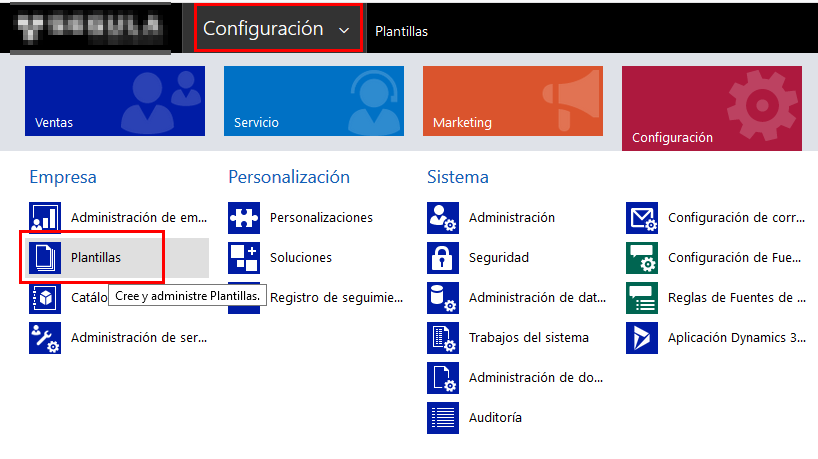
    2.  Desde ahí nos vamos a **Plantillas de Documento**.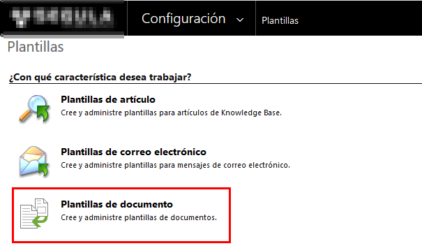
    3.  Y, en la ventana que nos aparece con la lista de plantillas actuales, pulsamos sobre **Nuevo**.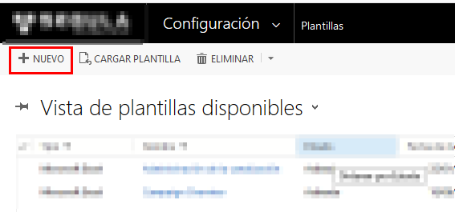
    4.  Escogemos **Plantillas de Word**, la **Entidad** sobre la que queremos trabajar (sacar datos para poner en el informe) y pulsamos sobre **Seleccionar Entidad**.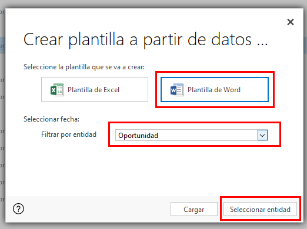
    5.  En la siguiente pantalla, por tanto, podemos **seleccionar aquellas entidades relacionadas** con la entidad principal de las que también queremos hacer uso de sus datos en la plantilla. En este caso escogemos las entidades de Cuenta y Usuario Propietario de la Oportunidad. Una vez tenemos todo lo necesario seleccionado, podemos pulsar sobre **Descargar Plantilla**.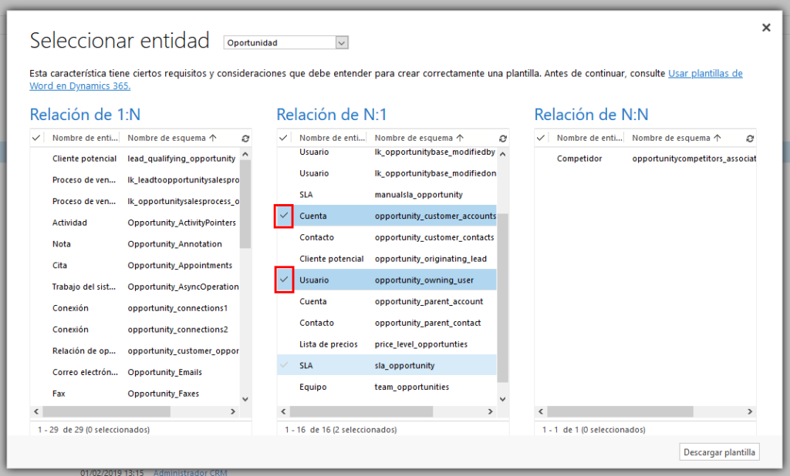
    6.   **Guardamos** el fichero generado en nuestro equipo.
    7.  Abrimos el fichero con Word y [**hacemos visible la pestaña de Programador**](https://support.microsoft.com/es-es/office/mostrar-la-pesta%c3%b1a-programador-e1192344-5e56-4d45-931b-e5fd9bea2d45?ui=es-es&rs=es-es&ad=es) en caso de que no lo esté ya. Dentro de esa pestaña seleccionamos la opción de **Panel de asignación de XML**.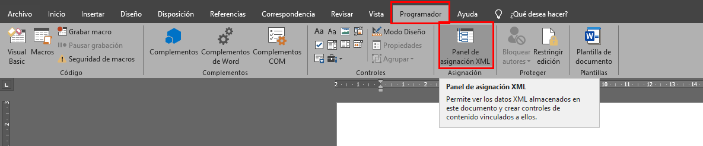
    8.  En el panel que aparece en la derecha **escogemos el XML que empieza por urn**.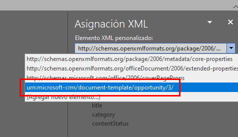
    9.  Vamos creando nuestra plantilla añadiendo elementos estáticos (imágenes, textos) y campos dinámicos que rellenará el CRM cuando ejecutemos el informe. Para añadir campos del CRM **escogemos el campo que queremos añadir** (en este caso accountidname, es decir el nombre de la cuenta asociada a la Oportunidad), **la opción de Insertar control de contenido y el tipo de dato que queremos insertar** (en este caso Texto enriquecido).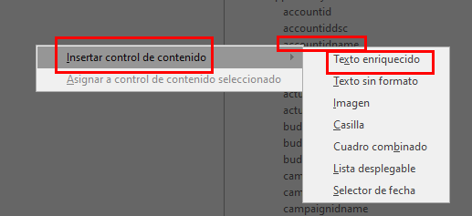
    10.  Vamos procediendo así **hasta que tengamos nuestra plantilla terminada**.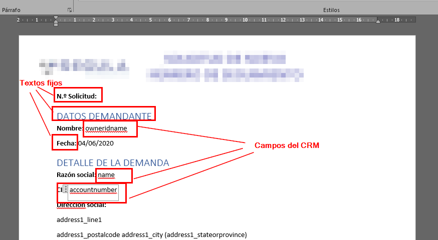
    11.  Volvemos a la pantalla del CRM en la que estábamos y pulsamos sobre la opción del menú de arriba de **CARGAR PLANTILLA**.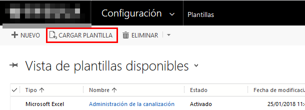
    12.  Seleccionamos nuestro fichero y damos a **Cargar**.
    13.   **Actualizamos los datos del informe** si queremos, como el nombre, por ejemplo, y **guardamos** la nueva plantilla.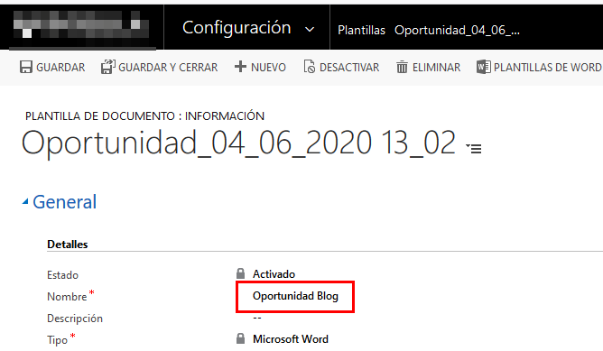
    14.  ¡Y listo! Ahora si nos vamos a una vista de Oportunidades y seleccionamos una podemos ver que en el menú de arriba tenemos la opción de **Plantillas de Word -> Nombre de nuestra plantilla**. Y nos descargará un fichero Word como el de nuestra plantilla pero con los datos rellenados con la información de esa Oportunidad.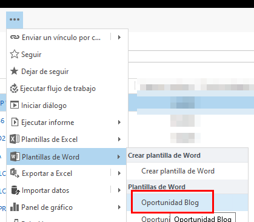

#### Conclusión

Como digo, no es una opción que nos vaya a ayudar en análisis de datos pero sí puede ser **útil de cara a que podamos generar informes imprimibles** para enviar de manera interna o externa. Que por [**mi experiencia**](https://www.victorgomezdejuan.com/vida-profesional/) veo que siguen siendo muy utilizados en la mayoría de PYMEs. Seguramente sea por ello que sistemas como Microsoft Dynamics CRM ofrezcan este tipos de facilidades para crearlos. Y puede ser una forma de **liberar de carga de trabajo al departamento de IT** pasando el trabajo de realizar la plantilla (o el diseño al menos) al departamento que demande el informe y una manera de **hacer más independientes a los usuarios**.
