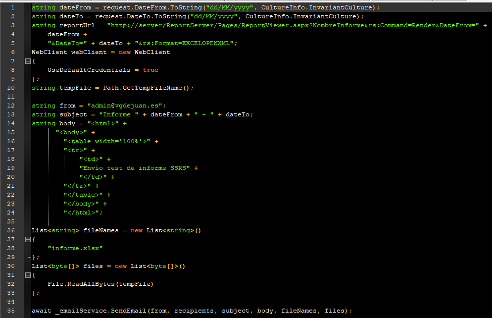
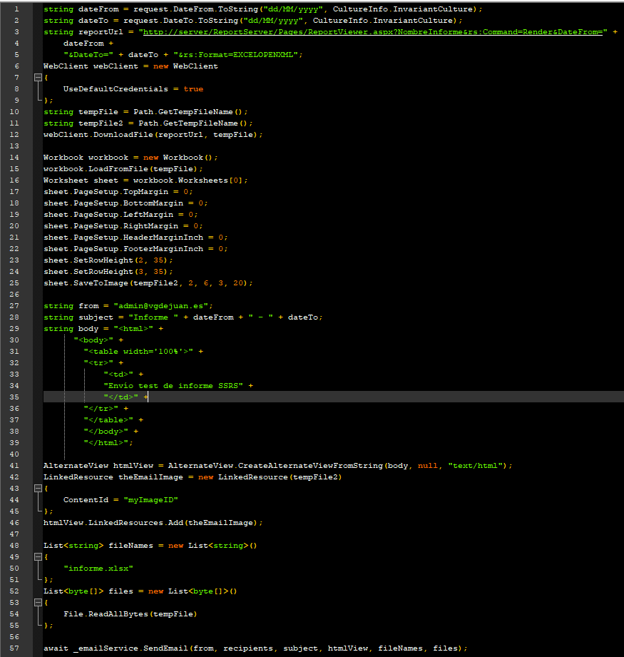

## SQL Server Standard Edition no acepta Data Driven Subscriptions

Durante mis años trabajando en el departamento de IT de la División de Mecanizado de CIE Automotive, pude comprobar la potencia de una herramienta tan [**desconocida y a veces infravalorada como SQL Server Reporting Services (SSRS)**](/archive/reporting-services-la-gran-olvidada/). En este departamento hacíamos un uso bastante considerable de las suscripciones. Éstas permiten, entre otras cosas, que un informe llegue al correo de un usuario en formato PDF, Excel o como queramos. Pero una de las cosas que más me entusiasmó fue conocer que tanto los parámetros con los que llamaba al informe para ser luego enviado, como los datos de los destinatarios o el contenido del email, podían ser parametrizados mediantes consultas SQL a una base de datos de nuestra elección. De esta manera, por ejemplo, podíamos enviar los datos de producción del día anterior a los responsables de cada planta. Y a cada uno le llegaban sólo los datos correspondientes a la planta de la cual se encargaban. Es decir, no teníamos ninguna necesidad de crear ningún programa o hacer uso de terceras aplicaciones por muy intrincadas que fueran las condiciones para el envío de un informe de forma periódica a determinados destinatarios. Así que, como en Segula Technologies teníamos una necesidad parecida, me puse a instalar el servidor SSRS en el servidor de SQL Server y crear el informe. Todo muy *happy* hasta que llegué al apartado de suscripciones del informe y... ¡horror! El formulario de suscripción era superbásico. Casi todo (destinatarios, asunto, contenido del mensaje, parámetros) tenía que ponerlo *a pelo*. Datos fijos, sin posibilidad de parametrización. Una búsqueda rápida en Google enseguida me presentó la razón: en Segula utilizamos SQL Server Standard Edition y en CIE Automotive teníamos Enterprise Edition. Toca buscar alternativa.

## Creando una suscripción basada en datos alternativa

Así tocó darle un poco al *coco* para intentar buscar una alternativa, gratuita a ser posible, que no llevara mucho tiempo, y fuera fácil de integrar en el [**portal que estamos implementando.**](/archive/clean-architecture-con-net-core/) Y que fuera fácil de mantener, claro. Por suerte, nuestro portal ya contaba con un [**servicio de Windows para ejecutar tareas periódicas**](/archive/anadir-servicio-de-windows-en-clean-architecture-con-net-core/) y un módulo para el envío de emails. ¡No todo iba a ser negativo! ? Para mi sorpresa, además, es relativamente fácil reproducir la funcionalidad de las sucripciones basadas en datos de SSRS (una vez tienes ya implementada la parte de ejecución de tareas programadas como es nuestro caso). Primero os presento el código de ejemplo y ahora os lo explico.  Podéis descargar el trozo de código haciendo click [**aquí**](https://www.victorgomezdejuan.com/wp-content/uploads/2020/08/codigo-suscripcion-SSRS-1.zip). Lo primero que hacemos es crear un objeto WebClient que nos permita realizar la petición HTTP para llamar a la URL del informe SSRS. Para ello, lo primero que tenemos que tener en cuenta es que tenemos que utilizar la URL del informe del Report Server o Web Service URL. Ésta NO es la URL con la que accedemos a la interfaz web de SSRS. Si no te acuerdas de esta URL, [**puedes consultarla en la configuración de SSRS**](https://lrscoolblobstrg.blob.core.windows.net/files/documentation/6.0%20sp9/fe/user%20guides/html/content/how_to_get_report_server_web_s.htm). Una vez que tienes esa URL, yo lo que hice es acceder con el navegador a ella y navegar hasta el informe en cuestión. Así conseguí la primera parte de la URL: http://server/ReportServer/Pages/ReportViewer.aspx?NombreInforme&rs:Command=Render. Aquí introducimos parte de la magía. Como ves, lo que hago es generar los parámetros (en este caso DateFrom y DateTo) dinámicamente en el código y así conseguimos parte de la funcionalidad de obtener el informe basado en datos. Además, al final le añado la cadena &rs:Format=EXCELOPENXML para obtener el informe en Excel. Otro aspecto importante es el uso del parámetro *UseDefaultCredentials* en la configuración del WebClient. Poniendo su valor a *true*, hacemos que nuestro objeto se loguee con los datos del usuario de Windows con los que ejecutas la aplicación. Así que, si no los tiene ya, acuérdate de darle permisos para ejecutar el informe. Con esto ya tendríamos el informe en Excel con el valor de los parámetros que hemos indicado en el código, y, de la misma manera, podemos indicar los destinatarios. Es decir, desde el programa decidimos a quién se envía el informe. En nuestro caso lo tenemos en un parámetro almacenado en una tabla de SQL Server (este código no lo he incluido en el ejemplo). Lo último que hago es llamar a mi servicio de Email para que se envíe el informe a quién corresponda. Este código, además, está contenido en un comando de MediatR que es llamado desde el proyecto que se despliega como un servicio de Windows. Es ahí donde le indico **cuándo** debe ejecutarse.

## Bonus track: Incluir la cabecera del informe en el contenido del email

Antes os he puesto el código simplificado porque yo creo que la mayoría de los/as lectores/as sólo demandaréis esa funcionalidad. Pero, en nuestro caso, necesitábamos también que el contenido de la cabecera del informe se incluyera en el *body* del email. ¿Por qué? Porque en esta cabecera se incluye la información que la mayoría de los destinatarios quieren saber. El resto del informe es el detalle de esos datos de la cabecera. Y queríamos que esas personas pudieran ver esos datos sin necesidad de abrir el Excel. Meter parte de un Excel en el contenido de un email no es cosa fácil. Otras posibilidades son coger el contenido de celdas específicas e incluirlo en el mensaje del correo o hacer la consulta por otro lado e incluir esos datos. A mí la que más me convencía, para no tener que duplicar la consulta (en el informe y en el código) y para no tener problemas para modificar el informe (al consultar celdas específicas) era coger las primeras filas del informe, exportarlas como imagen y pegar esa imagen en el mensaje (body) del email. Parece más difícil de lo que luego es, os doy mi palabra ?. Para ello hice uso de la librería gratuita [**Free Spire.XLS.**](https://www.e-iceblue.com/Introduce/free-xls-component.html) Os presento como queda el código completo:  Podeís descargaros el código haciendo click [**aquí**](https://www.victorgomezdejuan.com/wp-content/uploads/2020/08/codigo-suscripcion-SSRS-2.zip). El uso de esta librería ya [**se explica en su web**](https://www.e-iceblue.com/Tutorials/Spire.XLS/Spire.XLS-Program-Guide/Convert-Excel-to-Image-Worksheet-to-Image-in-C-VB.NET.html), así que tampoco me voy a liar demasiado con ello. Solamente indicaros que notéis las líneas donde modifico la configuración de la página del Excel y el alto de las líneas que exporto para que la imagen se vea bien. Luego incrusto esa imagen en el *body* del mensaje (por medio de las clases AlternateView y LinkedResource) para que los usuarios las vean nada más abrir el email.
