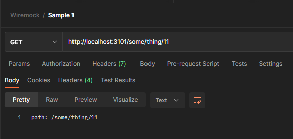
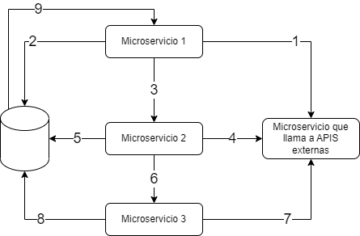

### Tests de integración en aplicaciones modernas

Son muchas las cosas que han cambiado en los últimos años en el desarrollo de software. Dos de ellas son:

-   El cambio de prevalencia de aplicaciones monolíticas y autosuficientes a aplicaciones distribuidas y que hacen uso de recursos externos.
-   ¡Ahora hacemos tests!

Sí, la última la digo con un poco de sorna, pero creo que a nadie se le escapa que al menos por estas tierras ha costado mucho empezar a ver la importancia de los tests automáticos (ya sean estos unitarios, de integración, end-to-end...). Y estoy seguro de que sigue habiendo muchos proyectos que carecen de un buen set de tests automáticos. Sin embargo, si eres de esos/as afortunados/as que trabaja en proyectos donde se realizan tests de integración, es posible que te hayas encontrado con el problema de cómo sortear las llamadas a APIs de terceros.

### APIs de terceros: WireMock.Net al rescate

Y es que, precisamente los tests de integración, por su propia definición, prueban varios componentes del software a la vez, y la interacción de estos entre sí. Pero, lo que no solemos querer probar casi nunca es si una API de terceros funciona o no. O no al menos en todos los casos. Es cierto que muchas plataformas te proporcionan entornos Sandbox para hacer pruebas de este tipo, pero estas herramientas tienen sus escenarios y casos de uso en los que son útiles y no suele ser recomendable incluir este tipo de pruebas en procesos muy frecuentes de CI/CD. Por suerte, existen librerías como [**WireMock.Net**](https://github.com/WireMock-Net/WireMock.Net) que nos facilitan la labor de mockear estas llamadas a APIs de terceros de forma muy sencilla y evitando tener que hacer malabares en el código para intentar testear la mayor parte del código posible sin tener que hacer esas llamadas. WireMock.Net es una librería para .NET basada en la popular herramienta [**WireMock**](https://wiremock.org/docs/) para Java. Sus ventajas fundamentales son tanto la facilidad de uso como la gran gama de escenarios diferentes que nos permite testear.

### Cómo funciona WireMock.Net

La manera de funcionar de WireMock.Net es muy sencilla. Esta librería te permite levantar un servidor que recibe llamadas HTTP y configurar varios endpoints en muy poquitos pasos para que respondan de la manera que tú definas y, al mismo tiempo, poder capturar los elementos de las llamadas que necesites para poder hacer consultas o simular un entorno con estado (que responderá a unas llamadas en función de las llamadas realizadas previamente). Para un ver un pequeño ejemplo de la potencia de WireMock.Net, podríamos crear una pequeña aplicación de consola como la siguiente:

```
internal class Program
{
    static void Main()
    {
        var server = WireMockServer.Start(new WireMockServerSettings { Urls = new[] { "http://localhost:3101" } });
        var response = Response.Create();
        server
          .Given(
            Request.Create().WithPath("/some/thing/*").UsingGet()
          )
          .RespondWith(
            Response.Create()
              .WithStatusCode(200)
              .WithHeader("Content-Type", "text/plain")
              .WithBody(req => ProcessRequest(req))
          );
        Console.ReadKey();
    }
    static string ProcessRequest(IRequestMessage requestMessage)
    {
        return

quot;path: {requestMessage.Path}";
    }
}
```

Esta aplicación de consola levanta un servidor HTTP en el puerto 3101 de nuestro localhost y, cuando reciba una llamada al endpoint http://localhost:3101/some/thing/ (añadiendo un 11 por ejemplo al path), recibirá como respuesta el relative path de la llamada realizada. 

### Utilizar WireMock.Net con xUnit

Seguro que esta pequeña aplicación ya te da una idea de las muchas aplicaciones que tiene WireMock para tus tests e incluso pequeñas pruebas durante tu desarrollo. Nosotros sólo hemos utilizado la propiedad *path* del objeto *IRequestMessage* que recibimos en el método *ProcessRequest* pero, como te puedes imaginar, puedes tener acceso a cualquier información de la petición HTTP para, junto con otra información que necesites, preparar la respuesta prevista para la API que estamos mockeando. Veamos ahora un ejemplo basado en una situación real que me encontré en el trabajo. En este caso, teníamos un proyecto basado en microservicios de los cuáles uno se encargaba de las llamadas a APIs externas (no estamos aquí para juzgar este enfoque 😄). El caso es que para ciertas pruebas de integración, se requería mockear este microservicio para que los otros microservicios que lo llamaban no tuvieran que hacer uso de éste. ¿Cuál era la complejidad de este escenario? El tema es que, para poder hacer esas pruebas de integración, tenía que haber una coherencia entre las operaciones que realizaba cada microservicio y que se veían afectadas por las llamadas de éstos al microservicio que, a su vez, llamaba a las APIs externas. Es decir, necesitábamos simular un estado. Era un escenario similar la siguiente:  Os pongo este escenario porque, aunque la estrategia utilizada de crear un microservicio para hacer las llamadas a APIs externas no os parezca buena idea (a mí no me convence demasiado), nos ayuda a ver que WireMock.Net no nos sirve sólo para mockear llamadas a APIs externas, si no que nos permite testear nuestros microservicios en aislamiento ya que nos permite mockear las llamadas que un microservicio realiza al resto de microservicios (o colas). Para el ejemplo que voy a poner ahora, sin embargo, por simplicidad, vamos a suponer que tenemos un microservicio que hace llamadas a una API salesmanager.net y queremos testear un escenario en el que realizamos varias operaciones de consulta y modificación sobre este microservicio. Para ello utilizaremos el framework [**xUnit**](https://xunit.net/), aunque no sería muy diferente utilizar cualquier otro como [**NUnit**](https://nunit.org/), por ejemplo. Entonces, ¿cómo gestionamos esto con xUnit? Primero creamos una clase encargada de gestionar todo lo relativo al mockeo de este microservicio llamada *WireMockFixture.*

```
public class WireMockFixture : IDisposable
{
    public WireMockFixture()
    {
        WireMockServer = WireMockServer.Start(new WireMockServerSettings { Urls = new[] { "wiremock_url" } });
        Sales = new Dictionary<string, decimal>();
        SetupMockupServer();
    }
    private void SetupMockupServer()
    {
        WireMockServer
          .Given(
            Request.Create().WithPath("/SalesOrders*").UsingPost()
          )
          .RespondWith(
            Response.Create()
              .WithStatusCode(200)
              .WithHeader("Content-Type", "application/json; charset=utf-8")
              .WithBody(req => ProcessPostSalesRequest(req))
          );
        WireMockServer
          .Given(
            Request.Create().WithPath("/SalesOrders/*").UsingGet()
          )
          .RespondWith(
            Response.Create()
              .WithStatusCode(200)
              .WithHeader("Content-Type", "application/json; charset=utf-8")
              .WithBody(req => ProcessGetSalesRequest(req))
          );
    }
    private string ProcessPostSalesRequest(IRequestMessage requestMessage)
    {
        SalesOrder salesOrder = JsonSerializer.Deserialize<SalesOrder>(requestMessage.Body);
        Sales[salesOrder.CustomerId] += salesOrder.Amount;
        return string.Empty;
    }
    private string ProcessGetSalesRequest(IRequestMessage requestMessage)
    {
        string customerId = requestMessage.PathSegments[3];
        JsonObject result = new() {
            ["totalSales"] = Sales[customerId]
        };
        return JsonConvert.SerializeObject(result);
    }
    public void Dispose()
    {
        if (WireMockServer is not null) WireMockServer.Stop();
    }
    public WireMockServer WireMockServer { get; private set; }
    public Dictionary<string, decimal> Sales;
}
```

Como puedes ver, lo que hace esta clase es crear un WireMockServer que atenderá las requests que hagamos sobre la url *wiremock\_url*. Esta clase tiene una propiedad para poder simular el estado: Sales. Esta propiedad, por tanto, hará las veces de base de datos en memoria para simular la persistencia que nos ofrece la API externa que no queremos testear. Creando esta fixture de la [manera estándar en xUnit](https://xunit.net/docs/shared-context) podremos obtener un objeto de tipo WireMockFixture en nuestras clases de tests. De manera que podemos hacer uso de ella por ejemplo de la siguiente forma:

```
[Collection("WireMock collection")]
public class SalesTests
{
    public SalesTests(ITestOutputHelper testOutputHelper, WireMockFixture wireMockFixture)
    [Fact]
    public void TestSales()
    {
        // Inicializamos los datos de ventas, que son los que, en entorno real, tendrá la plataforma externa a la que accedemos a través de su API (salesmanager.net)
        wireMockFixture.Sales = SalesFactory.GetSampleSales();
        //Llamamos al microservicio de Sales, que en entorno real llamaría a salesmanager.net, pero que en entorno de test tiene la url configurada como "wiremock_url"
        decimal initialSales = SalesMicroserviceHelper.GetSales("someCustomerId"); // microservicio de Sales hace la llamada GET /SalesOrders/someCustomerId
        decimal expectedSales = initialSales + 2000.15M;
        SalesMicroserviceFixture.AddSalesOrder("someCustomerId", 2000.15M); // microservicio de Sales hace la llamada POST /SalesOrders
        decimal updatedSales = SalesMicroserviceHelper.GetSales("someCustomerId"); // microservicio de Sales hace la llamada GET /SalesOrders/someCustomerId
        Assert.True(expectedSales, updatedSales);
    }
}
```

Creo que el código es sencillo y los comentarios ya explican lo que hace cada operación. Simplemente aclarar que la clase *SalesMicroserviceHelper* es la encargada de realizar las llamadas HTTP al microservicio de Sales, de manera que el código se pueda centrar en explicar mejor el escenario y sea más real también (y más limpio). Al crear el entorno de tests y desplegar los microservicios, en el caso del microservicio de sales lo desplegamos poniendo en su configuración que las llamadas a la API externa se deben realizar a *wiremock\_url* (cuando en el entorno real será a *salesmanager.net*).
