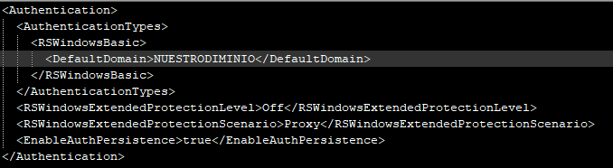

### Reporting Services para uso externo

Hasta ahora siempre había utilizado SSRS para uso interno. Me refiero a que todo el que tenía que acceder al portal de informes, lo hacía desde la LAN de la empresa o mediante VPN.

Sin embargo, en mi empresa actual son muchos los usuarios que necesitaban acceder desde fuera y, o bien no solían tener la VPN activada y esto suponía un problema para ellos y para nosotros (departamento de IT), o bien les era imposible instalar y activar nuestra VPN por estar trabajando en dependencias del cliente final.

Nunca me había planteado este escenario y, **hasta pensarlo un poco, no nos dimos cuenta de la problemática que llevaba asociada**. Reporting Services está instalado en el servidor donde está instalado SQL Server, lógicamente, y éste, al ser un servidor de BBDD, estaba conectado a la LAN. Y tiene sentido que sea así. **Por motivos obvios de seguridad, no queremos sacar este tipo de servidores a la DMZ para habilitar el acceso público a los mismos.**

**Tampoco queremos dar acceso directo desde fuera a un servidor de la LAN**, ya que para eso está la DMZ. Y tampoco queremos comprar una licencia de SQL Server sólo para instalar SSRS en un servidor de la DMZ y que éste haga uso del servidor de BBDD que está en la LAN. Uno de los motivos por los que habíamos optado por Reporting Services como herramienta de informes, era, precisamente, que [**suponía un coste cero adicional**](/archive/reporting-services-la-gran-olvidada/).

### Solución: Usar un proxy inverso

Después de consultar en Google y a proveedores, **la mejor opción resultó ser la creación de un proxy inverso en la DMZ** que traspara las peticiones que recibiera directamente al servidor de SQL Server/SSRS.

No me voy a liar a explicar todos y cada uno de los pasos para crear un proxy inverso, ya que, al ser un problema genérico, sobre eso ya hay bastantes artículos en Internet. Sí os voy a comentar, no obstante, que nosotros instalamos un Ubuntu Server con Apache y configuramos el Apache para que hiciera de proxy inverso y redirigiera la peticiones HTTP y HTTPS que recibiera a nuestro servidor de Reporting Services. Esto nos permitió implementar una solución a coste prácticamente cero ya que sólo tuvimos crear una máquina virtual para alojar el Ubuntu Server.

Además, **instalamos el certificado de nuestro dominio y forzamos que todas las comunicaciones con el proxy tuvieran que ser por HTTPS** para proteger los datos que se intercambiaran con él. Este servidor será el encargado de devolver toda la información de los informes y ésta es una información sensible y privada.

Link de artículo para instalar un proxy inverso con Ubuntu y Apache:

[https://websiteforstudents.com/configure-reverse-proxies-using-apache2-http-server-on-ubuntu-18-04/](https://websiteforstudents.com/configure-reverse-proxies-using-apache2-http-server-on-ubuntu-18-04/)

Articulo para forzar el uso de HTTPS:

[https://www.namecheap.com/support/knowledgebase/article.aspx/9821/38/apache-redirect-to-https/](https://www.namecheap.com/support/knowledgebase/article.aspx/9821/38/apache-redirect-to-https/)

Artículo para instalar el certificado SSL (Parte 2):

[https://www.digicert.com/kb/csr-ssl-installation/apache-openssl.htm](https://www.digicert.com/kb/csr-ssl-installation/apache-openssl.htm)

### Último paso: Habilitar Basic Authentication

Después de hacer todos los pasos descritos anteriormente, comenzamos a hacer pruebas sobre el servidor con el proxy inverso. En cuanto accedíamos a la URL correspondiente, nos pedía usuario y contraseña.

Esto ya era una buena noticia porque significaba que, efectivamente, el proxy estaba redirigiendo las peticiones al servidor de SSRS. Ya que éste, lo primero que te pide, es que te loguees. Sin embargo, **en cuanto introduciamos los datos y los enviábamos, nos volvía a saltar el formulario de login**. Esto nos hizo temernos lo peor: ¿incompatibilidad?

**SSRS por defecto habilita Windows Authentication**. Hasta ahora esto no suponía un problema para nosotr@s, pues nuestros usuari@s siempre se loguean con sus credenciales de Active Directory. Pero, en ese caso, esa autenticación fallaba continuamente.

Efectivamente, **el proxy no sabía resolver bien la autenticación de tipo NTLM**. Supongo que te puedes liar la manta a la cabeza e intentar que pueda autenticarse debidamente con este tipo de autenticación de Microsoft.

Nosotr@s, no obstante, optamos por una solución más práctica. **Sustituimos la autenticación de Windows por Basic Authentication en el fichero de configuración de SSRS** y listo. También le añadí nuestro dominio como dominio por defecto para que nuestr@s usuari@s no tuvieran que incluirlo en sus credenciales. Simple y efectivo. Ya teníamos nuestro portal de Reporting Services accesible desde Internet sin necesidad de activar VPN.

Os dejo aquí el artículo donde se explica cómo cambiar el tipo de autenticación en SSRS:

[https://docs.microsoft.com/es-es/sql/reporting-services/security/configure-basic-authentication-on-the-report-server?view=sql-server-ver15](https://docs.microsoft.com/es-es/sql/reporting-services/security/configure-basic-authentication-on-the-report-server?view=sql-server-ver15)

En nuestro caso, el trozo de XML a cambiar quedó así:

Espero que disfrutéis de esta estupenda herramienta que es SSRS ;-).
