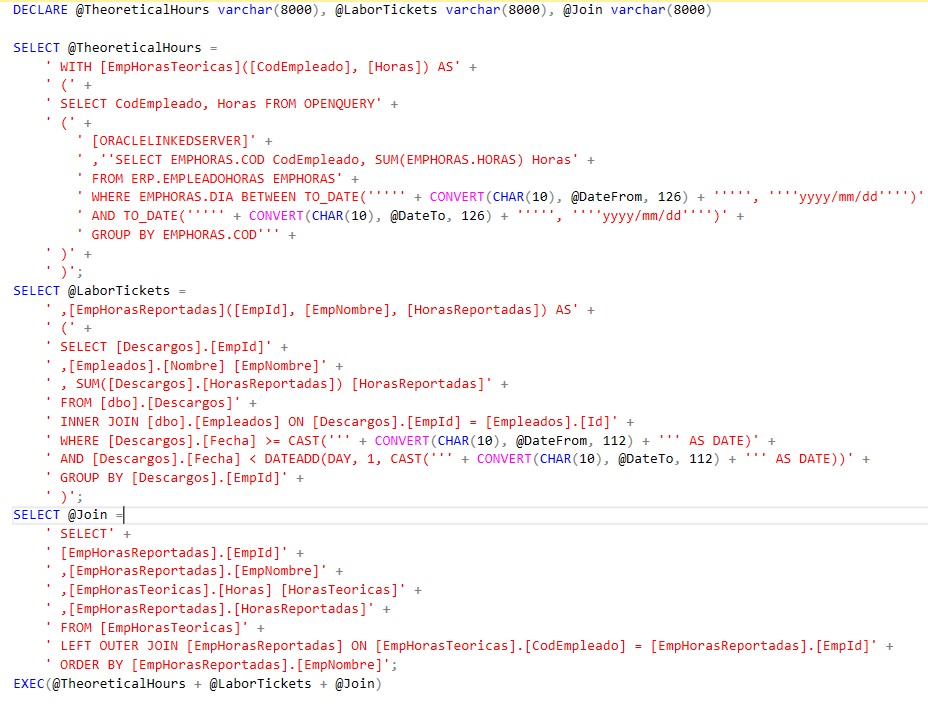

#### Problema

Tanto cuando trabajo en labores de [**Analysis Services (SSAS)**](https://en.wikipedia.org/wiki/Microsoft_Analysis_Services) como **[Reporting Services (SSRS)](/archive/reporting-services-la-gran-olvidada/) me gusta priorizar el rendimiento y posterior mantenimiento** sobre la comodidad a la hora de elaborar las consultas. Es por ello que muchas veces me *embarro* con gusto durante horas para intentar sacar una *cojoconsulta* que me quite de hacer tablas temporales o procesos de volcado periódicos que luego nadie sabe dónde se hacen o penalizan el rendimiento. Cuantas menos cosas tengamos que tener en cuenta a la hora de mantener nuestros sistemas de información, mejor. Es cierto que para alguien que no haya hecho la consulta puede resultarle algo tedioso intentar entenderla. Pero si se ha hecho una consulta limpia (incluso con comentarios, si es necesario) para mí siempre resulta más cómodo saber que sólo tengo que mirar ahí que ponerme a buscar consultas que llaman a otros vistas o procedimientos almacenados que a su vez llaman a otros y así en un proceso que penaliza el rendimiento y hace muy difícil su mantenimiento. Vale, entonces, en este caso me encontraba con la necesidad de crear una consulta que tenía que hacer uso de un origen de datos Oracle y otro de SQL Server y hacer una join con esas consultas. Y además, como era para un informe de Reporting Services, tenía que pasarle parámetros. Aquí empezaba el reto, ya que para hacer uso desde un motor de base de datos de SQL Server de un origen de Oracle tuve que crear un [**Linked Server**](https://www.sqlshack.com/es/como-crear-y-configurar-un-servidor-enlazado-en-sql-server-management-studio/)[.](https://www.sqlshack.com/es/como-crear-y-configurar-un-servidor-enlazado-en-sql-server-management-studio/) Hasta ahí todo bien, algo muy común cuando trabajas con diferentes motores de bases de datos. Sin embargo, esto me obliga a utilizar [**OPENQUERY**](https://docs.microsoft.com/es-es/sql/t-sql/functions/openquery-transact-sql?view=sql-server-ver15) para consultar los datos de la base de datos Oracle y **OPENQUERY no acepta parámetros**.

#### Solución

Muchas de las soluciones que he encontrado googleando por ahí no me han convencido ya sea porque directamente no me servían para lo que quería o por que requerían hacer más cosas aparte de la consulta. Y como probablemente sabréis, en [**SSRS**](/archive/reporting-services-la-gran-olvidada/) cada dataset, cada conjunto de datos, tira de una sola consulta. La solución que más se acercaba, y la que he terminado utilizando, era la que proponía utilizar la función [**EXEC de SQL Server**](https://docs.microsoft.com/es-es/sql/t-sql/language-elements/execute-transact-sql?view=sql-server-ver15) para ejecutar toda la query (OPENQUERY incluida) como un varchar y poder así pasar los parámetros. Pongo una versión demo de lo que he hecho:  Puedes descargar el código [**aquí**](https://www.victorgomezdejuan.com/wp-content/uploads/2020/06/oracle-sql-server-parameters-join.txt). Al ser una versión demo no la he probado y es posible que tenga errores, pero lo importante es entender la idea.

#### Explicación

Tal y como os he indicado toda la consulta va a ser un varchar que se ejecutará con la función EXEC de SQL Server. Para intentar no liarme, he creado tres variables varchar: una para la consulta OPENQUERY a la base de datos Oracle, otra para la query a la base de datos SQL Server (en la que se ejecuta la consulta definitiva) y otra para hacer la JOIN y la SELECT final. Al ser todo de tipo varchar, puedo incrustar los valores de los parámetros en cualquier parte. En este caso tengo dos parámetro de tipo datetime (@DateFrom y @DateTo). En la consulta original había uno más pero lo he suprimido para intentar hacer más fácil el ejemplo. Entonces, de la base de datos Oracle cojo las horas teóricas de cada empleado para cada día entre las fechas que me llegan como parámeto. Y de la base de datos SQL Server cojo las horas que el empleado ha reportado (en este caso nos da igual en que proyecto). Para poder hacer un JOIN posteriormente, lo que hago es guardar los datos de cada consulta en lo que en SQL Server se llama una [**tabla común (CTE)**](https://docs.microsoft.com/es-es/sql/t-sql/queries/with-common-table-expression-transact-sql?view=sql-server-ver15). De esta forma luego puedo hacer la JOIN con el resultado de cada consulta como si fueran tablas normales. Por último, he copiado toda la consulta, la he pegado sobre la query del [**DataSet**](https://docs.microsoft.com/es-es/sql/reporting-services/report-data/report-datasets-ssrs?view=sql-server-ver15) en SSRS, y ¡Voila! **Ya tengo mi informe en [Reporting Services](/archive/reporting-services-la-gran-olvidada/) tirando de dos orígenes de datos de motores diferentes.** En este caso Oracle y SQL Server. Espero que os sea útil y que os anime a hacer uso de consultas avanzadas para reducir el número de elementos creados para poder extraer datos de las bases de datos. Si tenéis cualquier duda, consulta o comentario podéis hacerlo debajo.
