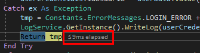
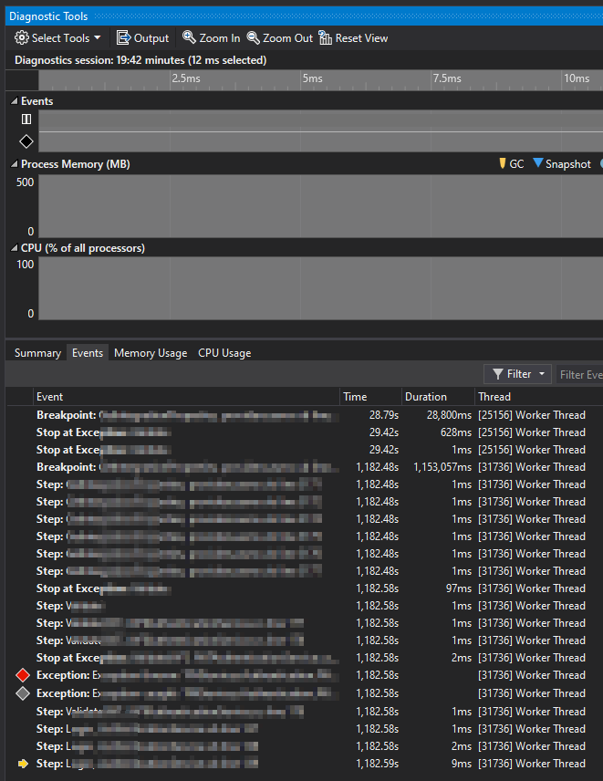
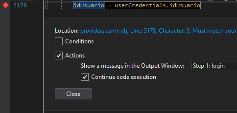

### Mejorar el rendimiento: una tarea clave

Como desarrolladores/as, nuestras **tareas suelen dividirse fundamentalmente en dos tipos**: las encaminadas a **ampliar, actualizar o modificar la funcionalidad** de la aplicación y las dirigidas a **mejorar el funcionamiento** de la aplicación en términos de errores y tiempos de respuesta.

Este post tiene como objetivo ayudarnos en las tareas del segundo tipo y, más concretamente, en **las tareas relacionadas con mejoras en el rendimiento**. Yendo al grano, este post puede resultar de utilidad para aquellas tareas destinadas a resolver peticiones que se resuelven de forma muy lenta o que dan error de timeout (tiempo de respuesta máximo excedido), ya sea de una petición de base de datos o de nuestra propia aplicación.

### La intuición: la técnica más recurrida

En este tipo de tareas, la técnica más recurrida, según mi experiencia, suele ser utilizar la intuición de uno mismo/a. Consiste, básicamente, en **poner puntos de interrupción** antes de sentencias clave en el código (normalmente accesos a bases de datos u otros recursos externos) y ejecutar esa sentencia para ver cuánto tarda. Visual Studio, además, nos facilita esta labor al **informarnos del tiempo que ha transcurrido** desde la última instrucción o punto de interrupción.

No es el objeto de este post "criminalizar" esta opción, que yo mismo utilizo a menudo, sino dar otra alternativa para casos en los que esta técnica es insuficiente o inefectiva. Como, por ejemplo:

-   Cuando **no conoces bien el código que tienes que revisar.**
-   Cuando **la llamada puede tener varias sentencias o trozos de código lentos.**
-   Cuando la **llamada se comporte de forma diferente en función del momento** (cachés, bloqueos, configuración, etc.)

### Visual Studio Diagnostic Tools

Cuando la cosa se pone más compleja, por cualquiera de las razones anteriormente expuestas (o por otras que no se me hayan ocurrido), **necesitamos hacer uso de** **herramientas de profiling**. Seguramente conozcas aplicaciones o plugins de este estilo para bases de datos, como [**SQL Server Profiler de SSMS (Management Studio)**](/archive/3-consejos-simples-para-mejorar-el-rendimiento-de-una-base-de-datos-sql-server/).

Éste era mi caso la primera vez que me encontré con un problema de este tipo y de alta complejidad relacionado con el código de una aplicación. También conocía técnicas/herramientas de logging que me daban datos interesantes de llamadas que ya habían sido realizadas. Pero, en ese caso, no me interesaba meter "chivatos" en el código y esperar, y tampoco sabía si la lentitud de una petición en concreto estaba relacionada con un problema en una base de datos o no.

Así que comencé la búsqueda y lo primero que encontré fueron **plugins de pago** para Visual Studio cómo [**éste de JetBrains**](https://www.jetbrains.com/profiler/) que, la verdad, tiene buena pinta pero, eso, es de pago. Y me costaba creer que Visual Studio no tuviera ya algo parecido aunque fuera más arcaico, y seguramente suficiente para lo que yo necesitaba.

Después de una búsqueda que me llevó más de lo esperable, lo encontré. Se trata de la vista [**Diagnostic Tools**](https://docs.microsoft.com/es-es/visualstudio/profiling/profiling-feature-tour?view=vs-2022) que, al parecer, se abre de forma automática al debuguear en Visual Studio, y lleva con nosotros desde Visual Studio 2015 (que yo sepa).

A los que nos habíamos acostumbrado a usar la intuición o manejábamos aplicaciones más pequeñas o que conocíamos bien, nos había pasado desapercibida. Pero ahí estaba y, además, es bien interesante.

### Cómo funciona

No es el objetivo de este artículo hacer un estudio minucioso de esta herramienta de VS, ni mucho menos. Si no que te voy a explicar básicamente lo que me parece más interesante de la misma.

Para el tipo de problemas de rendimiento de los que hemos hablado, lo más eficiente y efectivo es **ir a la pestaña Events** de esta vista **y ejecutar la petición completa de tu aplicación** (o el trozo que te interesa revisar) desde el principio hasta el final. Esta vista **te mostrará los eventos más importantes**: comienzo y fin de la petición, excepciones, queries de base de datos, breakpoints, etc. Además por cada evento, a la derecha, **te muestra el timestamp de cuándo comenzó ese evento y su duración**. Para las queries, además, te muestra el código de la propia query para que puedas ejecutarla por tu cuenta (parámetros aparte). Una joya, la verdad.

Una última recomendación. Para sacarle más jugo, **te recomiendo añadir breakpoints de notificación** (que NO paran la ejecución), de la siguiente forma:

Esto te permitirá ver los timpestamp de cada breakpoint e identificar en que parte del código estamos invirtiendo más tiempo.

Pues nada mucha suerte con la optimización del código, tarea ardua pero muy gratificante ?.
