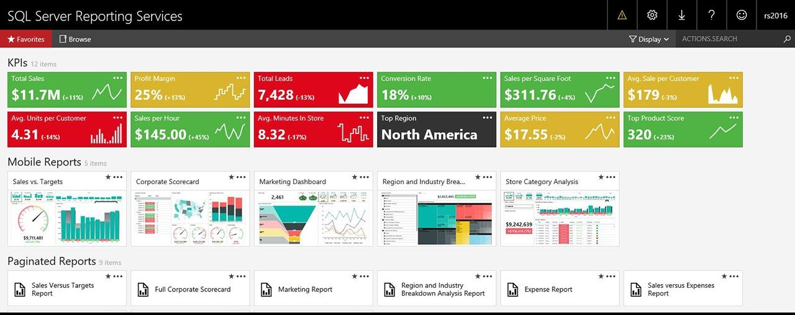
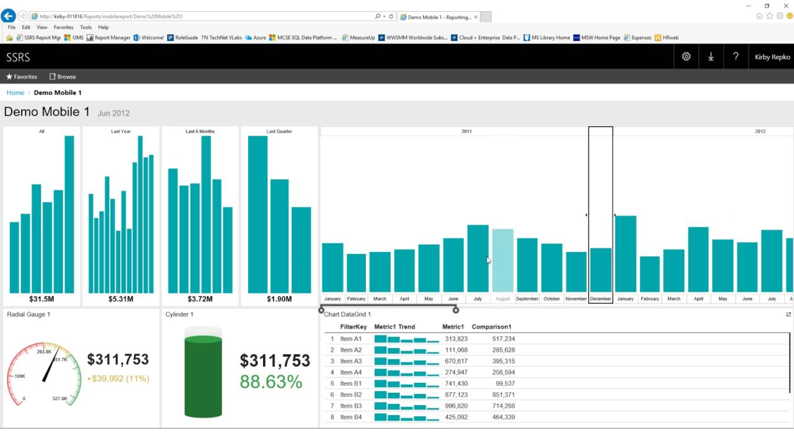
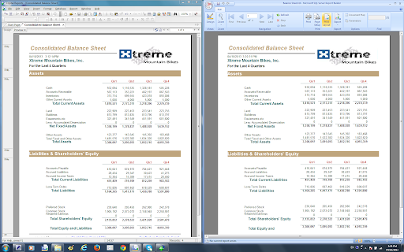

#### Las PYMEs y el reporting

Las experiencias que he vivido últimamente me llevan a pensar que **muchas pequeñas y medianas empresas desconocen el poder real de muchas de las herramientas de reporting** existentes en el mercado. Entre ellas y especialmente **Reporting Services**. Muchas de ellas siguen haciendo uso de **tediosos procesos de exportación** a Excel desde el ERP, **manipulación** manual de los datos para obtener la muestra requerida **y más pasos manuales** para sacar datos filtrados/agrupados y dejarlos bonitos para su presentación a otras personas. Decenas de pasos manuales repetidos para el mismo informe cada día, semana, mes, etc. **La mayoría de usuarios ya ni se quejan** porque creen que tiene que ser así. En ocasiones incluso son las propias personas del departamento de IT las que hacen estas labores y a los usuarios les parece normal que les lleven horas, que haya errores... En defensa de estos departamentos podríamos decir que muchos de ellos han sufrido recortes presupuestarios continuados que les han llevado a una cultura muy poco orientada a la innovación, la mejora y el progreso.

#### ERPs y demás sistemas de información con tecnología Microsoft

Aún así, en todos los casos que yo he visto (habrá casos por ahí que no, lógicamente), tenían al menos un **sistema de información basado en tecnología Microsoft** (normalmente el ERP). Entonces indagaba un poco y ¡tachaaaannn! Efectivamente, tenían una instancia de [**SQL Server**](https://es.wikipedia.org/wiki/Microsoft_SQL_Server) instalada con su licencia correspondiente. En la mayoría de los casos la licencia Standard. Y aquí viene la sorpresa para muchas. Esa licencia incluye la posibilidad de instalar un servidor de [**SSRS (SQL Server Reporting Services)**](https://docs.microsoft.com/es-es/sql/reporting-services/tools/tutorial-how-to-locate-and-start-reporting-services-tools-ssrs?view=sql-server-ver15). Una tecnología ya muy madura de Microsoft para la creación y visualización de informes dinámicos e integrados con el resto de tecnologías de la marca (sí, MS Office ?). Esta herramienta, desconocida para muchos, **permite crear informes operativos y de gestión** que pueden llegar a cubrir el 100% de la demanda de informes dependiendo de la empresa. En cualquier caso, yo diría que para casi cualquier PYME este porcentaje es muy elevado. ¡Y con algo que **ya estaban pagando**!

#### Pero... ¿de verdad sirve para mis necesidades?

Pues casi 100% seguro que sí. Reporting Services es tan **polivalente** que vale lo mismo para hacer el típico informe imprimible con cabecera y columnas como el *cojoinforme* de gráficos chuliguays para poner en tu PPT de ventas. Muestro algunos **ejemplos** extraídos de búsquedas en Google:

-   Ejemplo de página principal con **KPIs** e **informes** concretos a los que acceder debajo.

-   Informe con **gráficos, KPIs y datos** en filas.

-   Informe previamente realizado con Crystal Reports (**imprimible**) y rehecho con SSRS.

 Bueno, os dejo explorar por vosotr@s mism@s y sacar vuestras propias conclusiones. Aunque, sí, espero subir [**más posts**](https://www.victorgomezdejuan.com/desarrollo-de-software/) sobre esta tecnología que considero bastante infravalorada.

#### ¿Por qué Reporting Services y no otras herramientas?

Pues, depende del caso, obviamente, pero yo te daría fundamentalmente estas **razones**:

-   **Ya has pagado por ello**. Por una herramienta profesional y seguramente integrada con tu paquete de office (si usas el de Microsoft).
-   Porque **tiene una curva de aprendizaje muy baja**. Si ya has hecho consultas sobre SQL Server y has utilizado alguna otra herramienta para hacer informes (Crystal Reports, Oracle Reports, Stimulsoft, etc.) vas a empezar a hacer informes como un loco/a desde el principio. Y si no, no te va a costar más que lo que te costaría con otra herramienta.
-   Porque es una **herramienta supercompleta**. Te permite añadir filtros dinámicos, gráficos chulos, KPIs, datos en tablas, agrupaciones, subtotales, etc.

El mayor handicap importante que le veo con respecto a [**Power BI**](https://powerbi.microsoft.com/es-es/), por ejemplo, es la capacidad de interacción con los elementos del informe que tiene esta nueva herramienta de Microsoft. Además, Power BI tiene otras muchas cosas (y muy chulas), por supuesto, pero estoy intentando centrarme en la gran mayoría de necesidades de reporting de PYMEs. Y eso SSRS lo cubre de sobra. Power BI es una herramienta muy potente sobre todo para usuarios no técnicos pero, en caso de que ya tengas una licencia de SQL Server, SSRS va a ser más barato (sin coste adicional) y te va a ayudar a visualizar los datos de forma amigable, exportable y ágil. Anímate, dale un salto a tu oferta de reporting, a coste cero, y ganaté una medallita y palmaditas en la espalda. **Reporting Services gusta** y mucho a l@s usuari@s ?.

#### Recibe las novedades del blog en tu correo

He creado una lista de suscripción para que puedas recibir de manera semanal (en caso de que esa semana haya publicado algún post nuevo) las novedades del blog para esta categoría. Puedes apuntarte a través de [**este enlace**](http://eepurl.com/g8r3MP). ¡Gracias!
