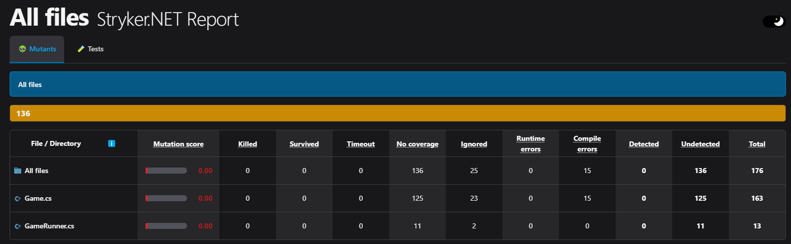
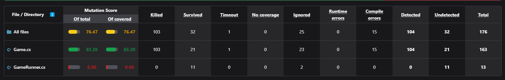
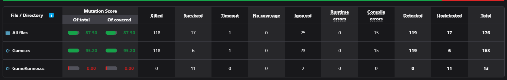
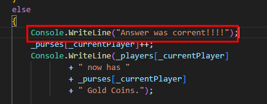
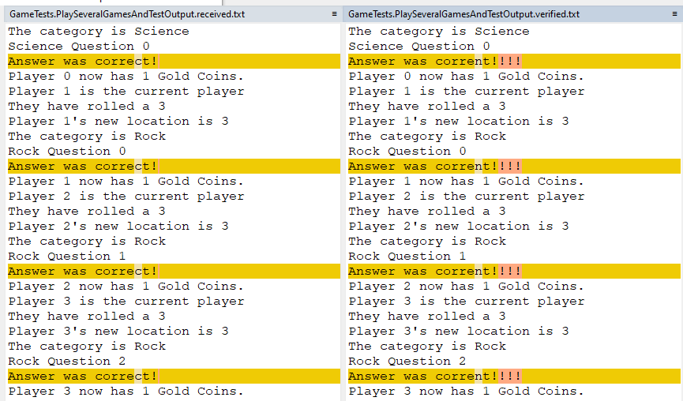

### Golden Master + Sampling en .NET

Una de mis técnicas preferidas para lidiar con código legacy es la [**Golden Master + Sampling**](https://blog.thecodewhisperer.com/permalink/surviving-legacy-code-with-golden-master-and-sampling), que aprendí cuando hice el más que recomendable curso [Surviving Legacy Code](https://online-training.jbrains.ca/p/surviving-legacy-code) de J. B. Rainsberger (también recomiendo [su curso de TDD](https://online-training.jbrains.ca/p/wbitdd-01)). ¿Por qué me gusta tanto esta técnica? Muy sencillo. Fundamentalmente se debe a que cuando te toca cambiar una base de código, o una parte de ella que no conoces, el mayor problema con el que te encuentras es que no sabes muy bien qué hace.

Y esto se trata de un problema central a la hora de modificar legacy code porque, si no sabes qué hace actualmente, ¿cómo vas a saber que no estás rompiendo nada al modificarlo para añadir nueva funcionalidad o modificar la existente?

¡Pues "fácil"! 😄 (entre comillas, sí, ya que varía mucho en función de la complejidad del código al que te enfrentes). Si conseguimos ejecutar un método que hace uso de la lógica que queremos modificar y guardamos los resultados obtenidos para diferentes datos de entrada, podemos conseguirlo con relativa facilidad. Para poder lograr esto **necesitamos 3 cosas**:

-   **Un método de código productivo accesible** a los tests que podamos ejecutar y que ejercite la lógica o la parte del código que queremos modificar.
-   Una herramienta sencilla con la que **guardar los resultados que obtenemos** para las diferentes ejecuciones que hagamos de ese método.
-   Una forma de **saber que hemos cubierto suficiente lógica** con los tests como para sentirnos tranquilos a la hora de hacer los cambios que queremos.

### Ejemplo práctico

Vamos a aplicar esta estrategia utilizando para ello una base de código suficientemente sencilla cómo para no tener que invertir mucho tiempo en comprenderla pero también mínimamente rica como para que merezca la pena aplicar la técnica de Golden Master + Sampling. Esto, como en la mayoría de casos de artículos de este tipo, implica que vas a tener que darle un poco al coco cuando quieras aplicarlo a un caso real, ya que el caso real en cuestión es bastante probable que sea más complejo que el de este ejemplo. Pero eso no implica que no se pueda aplicar. Simplemente tendrás que invertir más tiempo adicional en entender la mejor manera de aplicar la técnica.

**La base de código de ejemplo va a ser la siguiente: [https://github.com/jbrains/trivia](https://github.com/jbrains/trivia)**. Se trata de un repositorio que contiene código en mal estado en términos de diseño, claridad y legibilidad y es el que utiliza J. B. Rainsberger en el curso que he comentado anteriormente. Si indagamos un poco en este código, veremos que parece tratarse de un juego multijugador en el que los jugadores tiran el dado y responden preguntas hasta que uno de ellos resulta ganador.

```
using System;
namespace Trivia
{
    public class GameRunner
    {
        private static bool _notAWinner;
        public static void Main(string[] args)
        {
            var aGame = new Game();
            aGame.Add("Chet");
            aGame.Add("Pat");
            aGame.Add("Sue");
            var rand = new Random();
            do
            {
                aGame.Roll(rand.Next(5) + 1);
                if (rand.Next(9) == 7)
                {
                    _notAWinner = aGame.WrongAnswer();
                }
                else
                {
                    _notAWinner = aGame.WasCorrectlyAnswered();
                }
            } while (_notAWinner);
        }
    }
}
```

Imaginemos por tanto que nuestro Product Owner nos pide hacer una modificación sobre el código productivo del juego. Lo primero que hacemos es ver con qué red de seguridad contamos. Es decir, qué test suite tiene la aplicación. Veamos... ¡Horror! Hay un projecto de tests... ¡Sin tests! Alguien parece que intentó hacer algo... Pero se quedó en nada. Quizás pensó que al crear el proyecto de tests al menos alguien se animaría a añadir alguno... 😅

Esta situación, por desgracia, no difiere mucho de cualquier situación real que te puedas encontrar.

### Primeros pasos

El primer paso que **vamos a hacer es ver si la solución compila**. Ejecutamos *dotnet build* y... ¡Bien! Algo es algo 🙂. Esto, en realidad, no es fácil de conseguir en proyectos más grandes que llegan a tus manos y varias dependencias raras no documentadas. Así que, oye, no nos vamos a quejar 😉.

```
  Trivia -> C:TrainingSnapshot TestingTriviabinDebugnet6Trivia.dll
  Tests -> C:TrainingSnapshot TestingTestsbinDebugnet6Tests.dll
Build succeeded.
    0 Warning(s)
    0 Error(s)
```

**Un segundo paso sería ejecutar los tests** para ver si pasan. Como no tenemos tests de momento, lo que vamos a hacer es crear un test tonto de prueba y ver al menos si se ejecuta cuando hacemos un *dotnet test*. Como al parecer el proyecto está basado en xUnit y nos parece una buena librería, vamos a hacer esa prueba.

```
using Xunit;
namespace Tests;
public class GameTests
{
    [Fact]
    public void Test1()
    {
        Assert.True(true);
    }
}
```

Y... ¡Bingo! Nuestro test se ha ejecutado y ha pasado correctamente 🥳.

```
Passed!  - Failed:     0, Passed:     1, Skipped:     0, Total:     1, Duration: < 1 ms - Tests.dll (net6.0)
```

### Instalar la herramienta de Mutation Testing

Vale, sabemos que necesitamos tests que certifiquen que no hemos roto nada y el código productivo funciona como antes de que lo manipuláramos (o que sólo difere lo que queremos modificar). Pero... ¿Cómo conseguimos esto? Si no conocemos el código... ¿No? Aquí es donde resulta de mucha ayuda el concepto de [**mutation testing**](https://en.wikipedia.org/wiki/Mutation_testing). No es el objetivo de este artículo explicarlo, pero lo que sí necesitas saber son dos cosas:

-   [**La cobertura de tests normal no te garantiza que tengas bien cubierto el código**](https://journal.optivem.com/p/code-coverage-vs-mutation-testing) ante modificaciones no deseadas (el típico ejemplo de test sin assertion que genera cobertura sin comprobar nada es el caso más extremo para entender esto).
-   **La cobertura de mutation testing es una medida mucho más fiable** para tener confianza suficiente para tocar un trozo de código sin miedo a romper nada.

En nuestro caso, para medir nuestra cobertura de mutation testing, **vamos a utilizar la herramienta [Stryker.NET](https://stryker-mutator.io/docs/stryker-net/introduction/)**, que es una de las más populares y la única que he utilizado hasta ahora. Para ello, ejecutamos los siguientes comandos en nuestra consola:

```
dotnet new tool-manifest
dotnet tool install dotnet-stryker
```

Una vez instalada la herramienta, ejecutamos Stryker.NET por primera vez sobre nuestra solución con el comando *dotnet stryker.*



Para sorpresa de nadie, nuestra cobertura de mutation testing es del 0% (en este caso, igual que la cobertura normal).

### Aplicar la técnica Golden Master

Nuestro resultado de mutation testing no dejar lugar a dudas: **necesitamos cubrir con tests nuestro código para manipularlo con confianza**. Así que **vamos a intentar crear un test o una batería de tests que cubran la suficiente funcionalidad** como para conseguir dicho objetivo.

Por suerte, la clase *GameRunner* (que os he mostrado al comienzo del post) contiene un método main que parece ejecutar un juego de ejemplo en el que:

1.  Se crea el juego.
2.  Se añaden los jugadores.
3.  Los jugadores van tirando los dados (por turnos al parecer), y respondiendo preguntas de forma satisfactoria o errónea (en la clase *GameRunner* esto de decide forma aleatoria).
4.  Un jugador finalmente gana el juego.

Esto nos da una idea aproximada de cómo crear un test que ejercite el código de la clase *Game*, que en nuestro caso es la que queremos manipular. Para ello, primero tenemos que investigar de qué manera podemos recoger outputs generados por los métodos de la clase que queremos modificar. En este caso no resulta sencillo a primera vista, ya que los únicos métodos que devuelven algo son *WrongAnswer y WasCorrectlyAnswered*. Ambos devuelven únicamente un booleano, por lo que con total seguridad esto va a resultar insuficiente para poder añadir assertions que nos permitan verificar el funcionamiento correcto de la aplicación.

De esta forma, seguimos indagando y vemos que la clase *Game* imprime en consola una descripción de muchas de las acciones que realiza. Probablemente podamos utilizar esto como output con el que comparar las diferentes ejecuciones que hagamos de un mismo test. Después de hacer varias pruebas, llegamos al "test" que muestro más abajo.

En realidad, este test simplemente nos ayuda a ver que, al jugar al juego de manera similar a como lo hace la clase *GameRunner*, la clase *Game* genera output que puede ser suficiente para comparar su comportamiento en base a llamadas a sus diferentes métodos públicos. Lo que hemos realmente es guardar ese output en un fichero y chequearlo después.

```
[Fact]
    public void GameWithTwoPlayers()
    {
        using var stringWriter = new StringWriter();
        Console.SetOut(stringWriter);
        var game = new Game();
        game.Add("Victor");
        game.Add("Tao");
        var random = new Random();
        bool hasWon;
        do
        {
            game.Roll(random.Next(5) + 1);
            if (random.Next(9) == 7)
            {
                hasWon = game.WrongAnswer();
            }
            else
            {
                hasWon = game.WasCorrectlyAnswered();
            }
        } while (hasWon);
        File.AppendAllText(@"C:TrainingTestsoutput.txt", stringWriter.ToString());
    }
```

```
Victor was added
They are player number 1
Tao was added
They are player number 2
Victor is the current player
They have rolled a 5
Victor's new location is 5
The category is Science
Science Question 0
...
Victor now has 6 Gold Coins.
```

### Approval Testing o Snapshot Testing con Verify

Ahora que sabemos que tenemos un output sobre el que podemos comprobar el funcionamiento del código a manipular, necesitamos una herramienta que nos indique que el output generado antes de que nosotros modifiquemos el código productivo es el mismo que después de que nosotros lo hayamos manipulado. Dicho de otra manera: **necesitamos una herramienta que nos facilite comprobar que no hemos roto nada**. A esta técnica de testing se le llama Approval Testing o Snapshot Testing, y mi herramienta favorita para aplicarla es la librería [**Verify**](https://github.com/VerifyTests/Verify).

Así que instalamos esta librería con el comando *dotnet add package Verify.Xunit* sobre nuestro proyecto de test.

El uso de esta librería es muy sencillo, ya que lo único que tenemos que pasarle es un valor a comparar entre diferentes ejecuciones. Este valor puede ser un número, un string, un objeto, un array de bytes... Primero, Verify generará el fichero con el valor correcto, es decir, el valor sobre el que comparar las siguientes ejecuciones del test. En caso de que en alguna ejecución posterior del test dé un valor diferente al valor de referencia, el test fallará y Verify te mostrará ambos valores en tu aplicación de comparación por defecto (WinMerge, por ejemplo) para que decidas si actualizas el valor de referencia con el nuevo valor obtenido o no.

Vamos a probar una nueva versión de nuestro test haciendo uso de Verify y controlando los valores aleatorios para poder tener resultados de referencia. Nos queda lo siguiente:

```
    [Fact]
    public Task GameWithTwoPlayers()
    {
        using var stringWriter = new StringWriter();
        Console.SetOut(stringWriter);
        var game = new Game();
        game.Add("Victor");
        game.Add("Tao");
        var random = new Random(123);
        bool hasWon;
        do
        {
            game.Roll(random.Next(5) + 1);
            if (random.Next(9) == 7)
            {
                hasWon = game.WrongAnswer();
            }
            else
            {
                hasWon = game.WasCorrectlyAnswered();
            }
        } while (hasWon);
        return Verifier.Verify(stringWriter.ToString());
    }
```

Tras actualizar el nuget *xunit* para que sea compatible con Verify, ejecutamos el test, creamos el fichero de referencia con el resultado de la primera ejecución, y lo volvemos a ejecutar varias veces para comprobar que no hay variabilidad en los resultados.

Ahora vamos a volver a ejecutar Stryker.NET para ver qué grado de confianza nos da esta primera versión del test.



Con este simple test de jugar un partida con cierta aleatoriedad, hemos conseguido un 83,20% de cobertura de inmutabilidad, que no está nada mal. Pero es posible que sólo con un poco más de esfuerzo podamos conseguir uno o varios tests que nos den un 100% de cobertura o casi. Vamos a intentarlo.

Es aquí donde nos puede ser de gran ayuda **la técnica de sampling, que consiste en ejecutar el mismo test con diferentes parámetros de entrada** para recoger los diferentes resultados que nos da. En nuestro caso, vamos a utilizar el input *seed* (semilla) para calcular diferentes inputs que le pasaremos a la clase a testear *Game*. Es decir, en nuestro caso tenemos un input en base a cuál se generan otros inputs (número de jugadores, número de tiradas, etc.). De esta forma, conseguimos que nuestro test juegue 10 juegos diferentes en lugar de uno, como hacia hasta ahora. Recogemos los resultados de los 10 juegos y usamos Verify para comparar esos resultados y asegurarnos de que no cambien tras nuestras modificaciones sobre el código productivo.

De forma adicional, añadimos un par de unit tests que cubren funcionalidad que, gracias a Stryker.NET, hemos visto que no llegaba a cubrirse con nuestro Golden Master + Sampling. Puedes ver la clase con los tests [aquí](https://github.com/victorgomezdejuan/trivia/blob/main/Tests/GameTests.cs).

En este nuevo escenario, conseguimos llegar a un nivel de mutation testing coverage bastante aceptable:



Comprobamos además que lo que nos queda por cubrir es lógica que no nos interesa asegurar ahora mismo y/o que no se ve afectada por los cambios que queremos introducir. En nuestro caso es así, así que ya podemos empezar a modificar el código productivo con seguridad para introducir los cambios que nuestro Product Owner nos ha solicitado.

### Modificando el código productivo

Ya tenemos una red de seguridad, así que **vamos a abordar los cambios solicitados por nuestros stakeholders**. Uno de los cambios que nos han solicitado es que corrijamos el texto que se muestra cuando uno de los jugadores responde correctamente. Nuestro PO nos comenta que este texto tiene un error ortográfico, algo que comprobamos ejecutando la aplicación e incluso identificamos en las intrucciones que generan el texto erróneo:



El texto correcto a mostrar es "Answer was correct!" (ya de paso nos pide que quitemos las exclamaciones de más ya que resulta algo excesivo 😉).

Como nos gusta aplicar buenas prácticas, **primero vamos a refactorizar un poco** la clase para que no que no esté estrechamente acoplada a la consola al menos en este punto, **y luego crear un test unitario que cubra únicamente la lógica que hemos modificado**. Nuestro Golden Master nos ayuda a refactorizar con confianza y nos resulta muy fácil actualizarlo con el nuevo texto simplemente comprobando los cambios en el resultado generado gracias a una herramienta de comparación como WinMerge, por ejemplo.



Puedes consultar el resultado final de la refactorización y la corrección en [https://github.com/victorgomezdejuan/trivia](https://github.com/victorgomezdejuan/trivia). Como puedes ver, los propios tests añadidos ya nos indican que todavía tenemos varios problemas de diseño ya que tenemos que hacer una fase de *Arrange* bastante extensa, pero la idea es ir mejorando el código poco a poco 🙂.

### Palabras finales

¡Y hasta aquí el ejemplo de una de mis formas favoritas de abordar cambios y refactorizaciones sobre legacy code poco o nada testeado! Te recuerdo las técnicas que hemos ido viendo:

-   Golden Master
-   Sampling
-   Snapshot Testing
-   Mutation Testing

Espero que te haya sido útil y te ayude en aquellos proyectos con una base de código que carece de tests de calidad y de la que además desconoces mucho de su código productivo. Ya sabes, cualquier duda, en los comentarios 😉.
