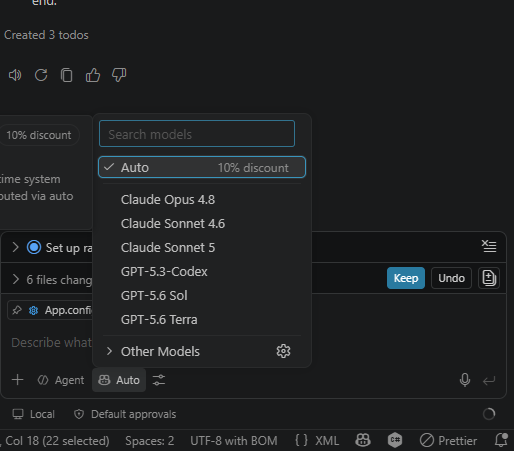
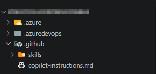
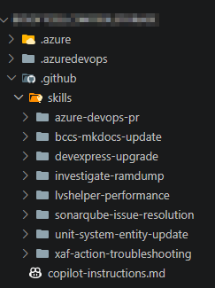
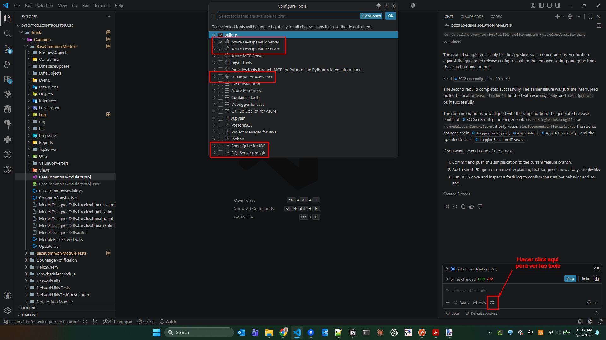

## Hype vs. realidad

Esto de la IA **se nos está yendo de las manos**. En esto, creo que muchos estamos de acuerdo, y seguramente por diferentes razones y escenarios que nos hemos ido encontrando en estos últimos meses.

En este artículo te explico cómo, a día de hoy (25 de julio de 2026), estamos usando GitHub Copilot en mi equipo de desarrollo de software. La mayoría de cosas, por no decir todas —con algún ajuste de nombres y de configuración—, son aplicables a cualquier asistente IA de codificación como Claude Code o Codex.

¿Por qué digo que esto de la IA se nos está yendo de las manos? No lo digo tanto por la tecnología en sí —que probablemente también, al menos en lo referente al *hype* que se ha generado—, sino sobre todo por la gran cantidad de publicaciones que salen sobre la última «*superfeature* que cambiará el mundo y te hará explotar la cabeza».

Por eso me he decidido a escribir este artículo, a riesgo de ser percibido como un dinosaurio, alguien que está detrás de lo *trendy* o un mediocre.

## Qué modelo utilizar

El tema de los modelos da para mucha literatura, pero la realidad es que no existe un consenso claro sobre qué modelo es mejor —está ahí la perversión de las pruebas a las que se someten para crear los rankings— y desde luego parece claro que no hay un modelo mejor para todo, ya que tenemos que tener en cuenta varias variables.

Simplificando, se trata de jugar con dos variables:

- Coste.
- Potencia.

Yo, cuando salió Claude Opus, comencé a utilizarlo para casi todo, ya que la diferencia con Claude Sonnet, el modelo que utilizaba anteriormente, era evidente. Sin embargo, al utilizar la herramienta más gente en la empresa, tuvimos que autorestringirnos por un tema de presupuesto, y a partir de ahí he utilizado el **modo Auto** casi en exclusiva. Solo una vez tuve que seleccionar Claude Opus a mano porque, si no, me daba un error todo el rato.

Conclusión: si tu nivel es parecido al mío, no te compliques. Usa el modo Auto siempre y a tirar.

## El fichero `copilot-instructions.md` (o `CLAUDE.md`, o `AGENTS.md`)

Este es **el primer fichero que debes crear** cuando empiezas a trabajar en un repositorio concreto con GitHub Copilot. Lo más fácil, y esto aplica para casi cualquier uso de Copilot, es pedirle al propio asistente que lo cree. Puedes utilizar un prompt de este estilo —yo siempre le escribo en inglés—:

> This repository holds the code of an application called “XYZ”, whose purpose is “bla, bla, bla”. Make a deep analysis of the whole repo and create a complete `copilot-instructions.md` file that helps you every time you are asked to query, create or edit any file in it. You should include a good description of every module, conventions, architecture, etc.
>
> Every time I request you to modify something or implement a new feature, you should follow the following rules:
>
> - Apply SOLID principles
> - Apply Vertical Slice Architecture with Clean Code principles
> - Generate unit tests for business logic/entities
> - Generate acceptance tests for the added/modified logic
>
> Add these rules to the copilot-instructions file so that you always follow them.

## Crea tus propias skills

El segundo paso natural, tras tener el fichero `copilot-instructions.md` creado y bien cumplimentado, es la creación de skills. Las skills, simplificando mucho, son como diferentes `copilot-instructions` que se utilizan en determinados momentos. Las puedes invocar tú directamente —con barra más el nombre de la skill— o automáticamente cuando Copilot identifica que debe usarla en función de lo que le has pedido que haga.

Lo normal, en mi experiencia, es **ir creando estas skills sobre la marcha**, cuando realizas una tarea que prevés que vas a volver a realizar, o cuando ves que estás haciendo continuamente la misma tarea con los mismos pasos o muy parecidos.

Te doy ejemplos de skills que he creado yo:

- Skill para crear una pull request en Azure DevOps.
- Skill para actualizar un framework importante de tu aplicación.
- Skill para actualizar la documentación de tu proyecto.
- Skill para realizar *troubleshooting*, investigar errores reportados por usuarios o QA.
- Skill para resolver *issues* de SonarQube.
- Skill para mejorar el rendimiento de la aplicación.
- Skill para implementar una *feature* que implica realizar la misma modificación en diferentes módulos, entidades o partes de sistema.

Como ves, se puede hacer una skill para casi cualquier cosa. Pero es importante que se cumplan estos requisitos:

- La tarea va a realizarse más de una vez.
- La descripción de la skill aporta algo diferente a lo que Copilot ya hace por defecto y a lo que ya tienes indicado en `copilot-instructions`.
- Cuando no vas a aplicar más una skill, la eliminas.

Lo bueno de las skills es que solo se cargan en el contexto cuando son necesarias —y las partes de la skill que son necesarias—. Esto ahorra coste y mejora el rendimiento de Copilot. Lo malo es que la descripción general se carga siempre, por lo que conviene eliminar las que se quedan obsoletas. Esto también es importante por limpieza, claridad y mantenimiento, por supuesto.

Un tema que me parece importante comentar: yo normalmente primero realizo una tarea de forma «normal» con Copilot, pidiéndole una cosa, afinándola con más interacciones y, finalmente, **cuando ya estoy satisfecho, le pido que cree una skill con todo lo que ha aprendido** en ese chat para poder aplicar lo mismo en el futuro. Así evito los *back and forths* que hemos tenido durante la conversación y hago más eficiente el uso de la skill.

Un prompt para crear una skill podría ser algo así:

> /create-skill Gather all the knowledge from the current chat to create a new skill to “bla, bla, bla…”. Make sure you set all the steps and instructions in a way that we avoid having the same back and forths we experienced during the chat interaction. Ask me any doubt you may have.

## Utiliza servidores MCP para conectar Copilot con herramientas externas

El tema de los MCP es un poco controvertido, porque pasaron de ser la repera a estar vilipendiados, y ahora se encuentran en una especie de valle de si sí o si no deberían ser usados.

Yo hablo desde mi experiencia, y mi experiencia es que han mejorado bastante y me son muy útiles. Actualmente uso mucho:

- El servidor MCP de Azure DevOps para que Copilot se conecte a este para leer el contenido de un ticket, comentar en un ticket, crear una pull request o revisar la pull request de un compañero.
- El servidor MCP de SonarQube para que Copilot pueda saber qué *issues* hay creadas y cómo resolverlas.
- El servidor MCP de SQL Server —hay prácticamente para cualquier motor de base de datos— para que Copilot pueda consultar el esquema y las tablas de la base de datos de la aplicación; solo con acceso al servidor SQL local de desarrollo, por supuesto.

**Es importante activar y desactivar las tools que necesitas en cada momento o chat**, para que Copilot pueda hacer uso de las herramientas que necesita y descartar otras. Por funcionalidad y por coste.

Te informo también de que el ecosistema de los servidores MCP y las tools es un poco *wild west*: existen varios servidores MCP para las mismas herramientas y no todos funcionan igual de bien. Sin embargo, hay algo que sigue funcionando: prueba y error 😉.

## Back to basics: mejora continua

¿Recordáis aquellas estrategias, valores y principios con los que nos bombardeaban —yo incluido— antes de la aparición de esta ola de la IA? Clean Code, Continuous Integration, Automated Testing, etcétera. Pues… ¡sorpresa! La mayoría siguen aplicando. Pero creo que sobre todo uno de ellos por encima del resto: *Continuous Improvement*, mejora continua.

El juego no acaba aquí. Tan solo acaba de empezar.

- Cada vez que Copilot no se comporte como quieres, **dile que actualice el `copilot-instructions`** y lo corrija de la forma que tú le indiques.
- Cada vez que al utilizar una skill el resultado no sea el esperado o Copilot se vuelva loco intentando hacer algo concreto hasta que lo consigue —me pasó con el acceso a Azure DevOps—, **dile que corrija la skill** para que sea más eficaz y eficiente la próxima vez.
- **Sigue creando skills** que te puedan ser útiles en el futuro. **Sigue eliminando** las que ya no vayáis a utilizar.
- **Estate atento** a los nuevos servidores MCP que vayan saliendo, ya que pueden ser mejores que los que utilizas actualmente.
- **Comparte tus hallazgos** con tus compañeros y **pregúntales** en caso de duda o cuando veas que hacen algo que te puede resultar útil a ti.

Ya sabes. Back to basics! 😜
