Cada día vemos diferentes publicaciones mostrándonos cómo la IA ha cambiado la vida, o una parte importante de ésta, a personas y empresas. Parece que sirve para todo, y que si todavía sigues haciendo algo manualmente, es que estás haciendo algo mal o te estás quedando atrás.

Por eso me parece importante crear este post en el que explico cómo uso yo la IA actualmente en mi vida personal. Sin fuegos artificiales ni trucos mágicos, como me suele gustar explicar las cosas.

## ChatGPT y sus personalizaciones

Antes de nada… Sí, todavía uso ChatGPT. Es la primera herramienta que creo que todos comenzamos a utilizar y, cuando estaba casi decidido a cambiarla por Claude, leí [este post de La Mafia IA](https://aimafia.substack.com/p/configurar-chatgpt-en-10-minutos) y comencé a sacar mucho más partido a ChatGPT. La suscripción de *chatty* sigue siendo más barata que la de Claude y te permite utilizar la herramienta de Codex (similar a Claude Desktop) en Windows, por lo que conviene pensarse bien el paso de uno a otro. Porque realmente a día de hoy ofrecen cosas muy similares para el uso que necesita darle el 90% de la gente.

¿Cómo empecé a sacar más partido a ChatGPT? En el post de La Mafia IA que te he indicado antes viene bien explicado, pero resumiendo:

- Rellenar el apartado de **Custom Instructions** (en Settings → Personalization). Aquí básicamente le indico al «bicho» que sea imparcial y no me dore la píldora (incluso que haga de abogado del diablo), que sea conciso, que me indique cuando no está realmente seguro de algo, que no haga suposiciones, que pregunte cuando necesite saber algo más de lo que he proporcionado hasta ahora, que no alargue las conversaciones con preguntas adicionales que no están relacionadas con mi petición original, que contraste lo que dice y que cite las fuentes usadas. Todo esto convierte a ChatGPT en una máquina bien engrasada para dar soluciones en la forma en la que tú quieres.

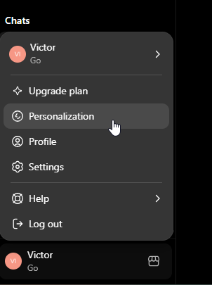

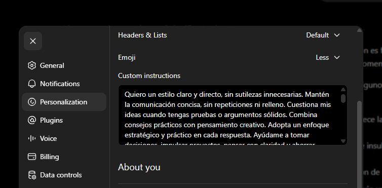

- Rellenar el apartado **More about you** (en Settings → Personalization). Sí, sé que puede dar un poco de cosa darle datos personales a ChatGPT, pero… Qué quieres que te diga, hace tiempo que Google y otras empresas recogen datos nuestros sin que nos enteremos, e incluso comprenden cosas nuestras que ni nosotros nos hemos dado cuenta todavía. Yo, en cuanto a ratio coste/beneficio, lo tengo claro. Al final le voy a contar las mismas cosas pero repetidas en decenas de chats. Para eso, prefiero ponerle datos relevantes míos aquí (edad, sexo, profesión, municipio, situación personal, etc.), y olvidarme de tener que indicarlo cada vez que sea relevante.

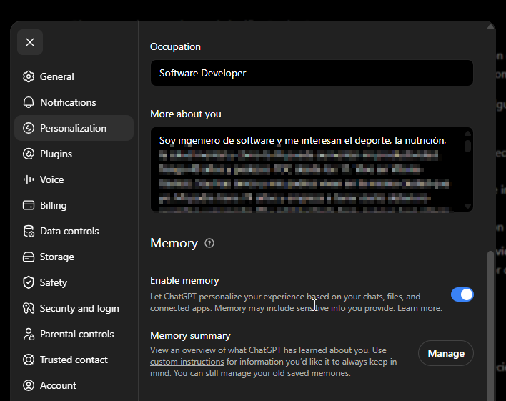

- Activar la **memoria**. Si no te viene activada por defecto (imagen de más arriba), actívala, y ChatGPT comenzará a recordar cosas clave de las conversaciones. Te sorprenderá lo que esto facilita tu interacción con *chatty*.
- Crear **proyectos**. La madre del cordero (al menos antes de que se añadiera la *feature* de la memoria). Crear proyectos para diferentes actividades y ámbitos de mi vida le ha dado otra vuelta a mi uso de ChatGPT. Tengo proyectos para:
  - Entrenamiento
  - Nutrición
  - Salud global
  - Gestión económica
  - Aprendizaje de inglés
  - Y unos cuantos más, más personales. Aquí ya hasta dónde cada uno quiera llegar. No me tomo la palabra de ChatGPT como la de Dios y no miro nada más, sino más bien como formas de ver ángulos muertos o probar nuevas vías, o simplemente como meditar sobre algo con un apoyo externo y (a ser posible) imparcial.

¿Cómo funcionan los proyectos? Pues es muy sencillo. Para crear uno nuevo simplemente vas a Proyectos y le das al icono de «más» (+). Indicas un nombre, un icono y un color. Una vez creado, vas a las settings del proyecto y rellenas un texto donde le das contexto a ChatGPT de toda la información que pueda ser útil y de cómo debe comportarse en sus respuestas.

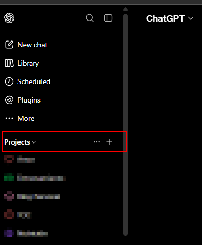

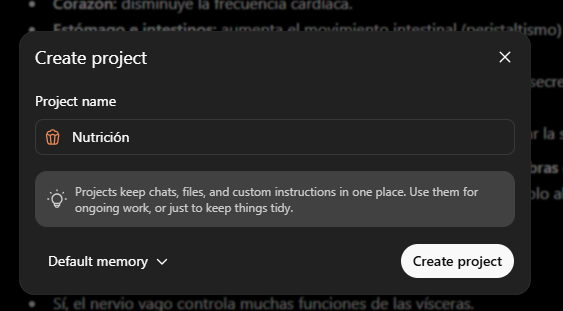

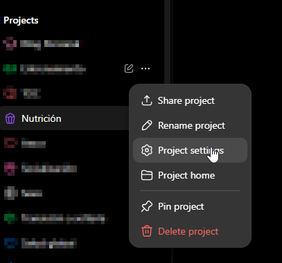

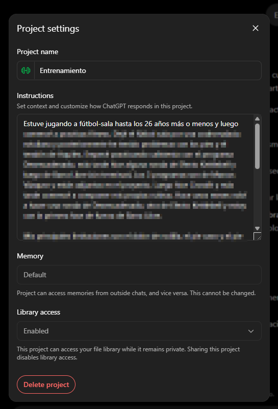

Además, puedes añadir documentos al contexto, lo cual puede llegar a ser muy útil. Puedes añadir por ejemplo programas de entrenamiento que tengas en Word o PDF, contratos, libros o cualquier otro documento que ayude a ChatGPT a darte mejores respuestas y a ti a no tener que adjuntarlos cada dos por tres en diferentes chats.

Para ello, debes ir a Project Home y hacer clic en la pestaña de Sources.

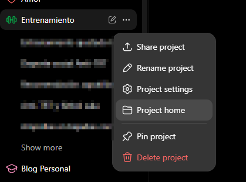

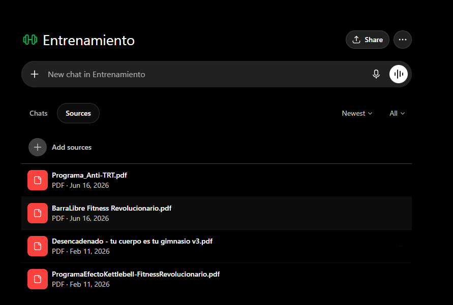

Por ejemplo, si tienes un proyecto de nutrición, le puedes pasar el contexto de tus datos de peso, altura, composición corporal, etc., e indicarle tus objetivos a este respecto. Además, puedes adjuntar documentos con resultados de análisis, prescripciones, notas de tu nutricionista, libros en los que te basas para las bases de tu nutrición, etc.

Un último apunte. Te recomiendo guardar los contextos de los diferentes settings en tu equipo, ya sea en una carpeta local y ficheros txt, en Notion, en Notas… De esta manera, si en un momento determinado quieres empezar a utilizar otra herramienta como Claude o Gemini, te resultará mucho más fácil el cambio. Claude Desktop, por ejemplo, podría hacer uso de estos ficheros locales de manera inmediata.

## Google no ha muerto

A veces la línea entre búsqueda por Internet y consulta general es muy fina. Seguramente mucho tenga que ver con la tendencia que tenemos muchas de las personas que vivimos el nacimiento de Google y lo hemos estado usando intensivamente desde entonces.

Por lo que sea, pero es verdad que muchas veces me sorprendo buscando algo en Google a la vieja usanza y casi al instante cambiando a la pestaña de IA para obtener una respuesta más inmediata.

Otras veces, directamente le pregunto a Gemini a través de la misma pestaña de IA de Google, en lugar de usar ChatGPT. Esto se debe, creo, fundamentalmente a dos razones:

- **Comodidad**. Google es Google. Sigue siendo la opción por defecto para muchos y, si usas Chrome, te resulta más fácil preguntar en la barra de direcciones del navegador que irte a ChatGPT u otra página del estilo.

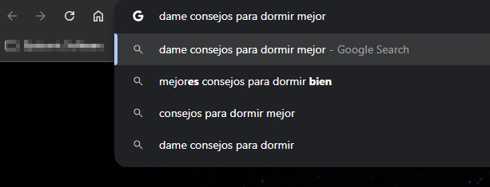

- Uso de **referencias de Internet**. A veces a ChatGPT o Claude les cuesta salir a buscar la información a Internet. Gemini, o Google AI, suele ser mucho menos reticente. Esto te ahorra tiempo y a veces incluso te evita errores. Además, en Google AI es mucho más fácil luego clicar sobre una referencia para ir a la supuesta fuente y contrastar.

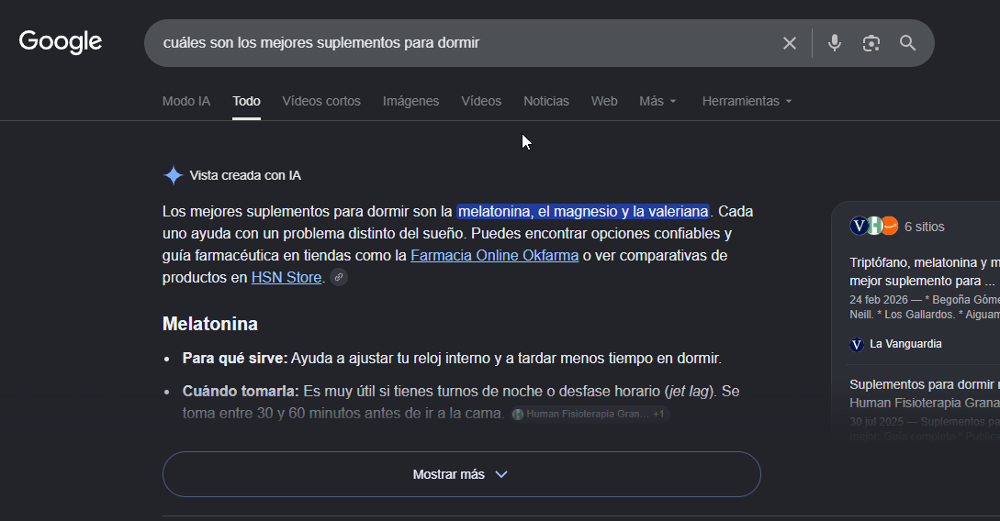

## Otros usos

ChatGPT y Google cubren prácticamente todas mis necesidades de uso de IA generativa a nivel personal. Pero también es verdad que no me paro ahí y, sobre todo por mi perfil profesional (pero no sólo por eso), intento ir más allá.

### GitHub Copilot

No me extenderé sobre esto. Si te interesa, mira [este post](/blog/empezar-github-copilot-equipo/).

### Claude Code

Mi página web está hecha con esta herramienta. Desde el principio. Incluso el hosting, el despliegue, el mantenimiento de código… Todo está hecho consultando y pidiendo las cosas directamente a Claude Code.

### Plugin de Claude para PowerPoint

Si eres de los que crea y/o edita muchas presentaciones en tu trabajo o tus proyectos personales, este plugin de Claude puede ahorrarte muchísimo tiempo y mejorar la calidad de tus presentaciones de manera significativa.

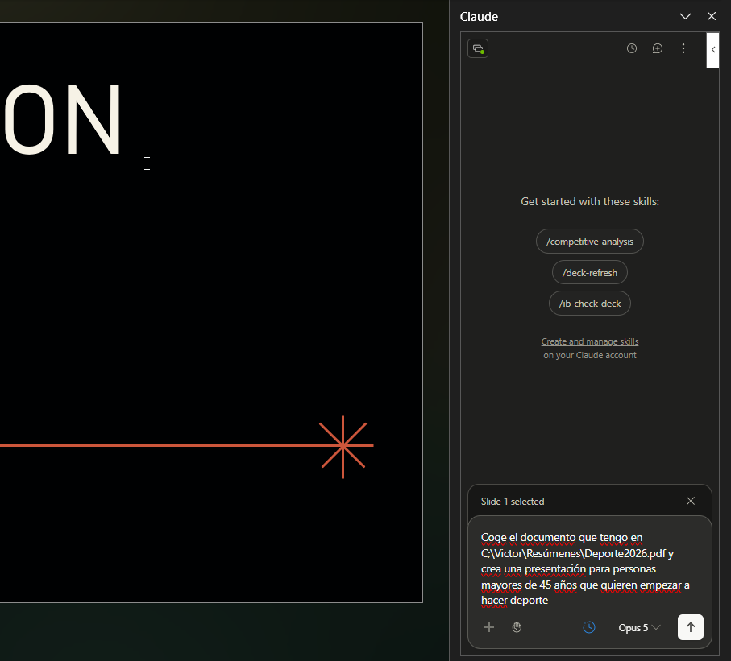

### Cursos de Anthropic

Lo suelo comentar por [LinkedIn](https://www.linkedin.com/in/victor-gomez-de-juan/) pero, si no me sigues, que sepas que Anthropic (la empresa detrás de Claude) tiene multitud de cursos online gratuitos de bastante calidad para que aprendas cómo utilizar sus herramientas. Como ya te he comentado antes, las herramientas de Claude y las de la competencia tienen bastantes similitudes y comparten bastantes funcionalidades, por lo que mucho de lo que aprendas en estos cursos te puede ser de utilidad a la hora de utilizar las herramientas del ecosistema OpenAI o Google, por ejemplo.

La web de la academia de Anthropic es [https://anthropic.skilljar.com](https://anthropic.skilljar.com/).

Espero de corazón que algo de esto te sirva para hacer un uso más eficiente y eficaz de la IA 😉.
