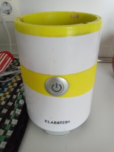
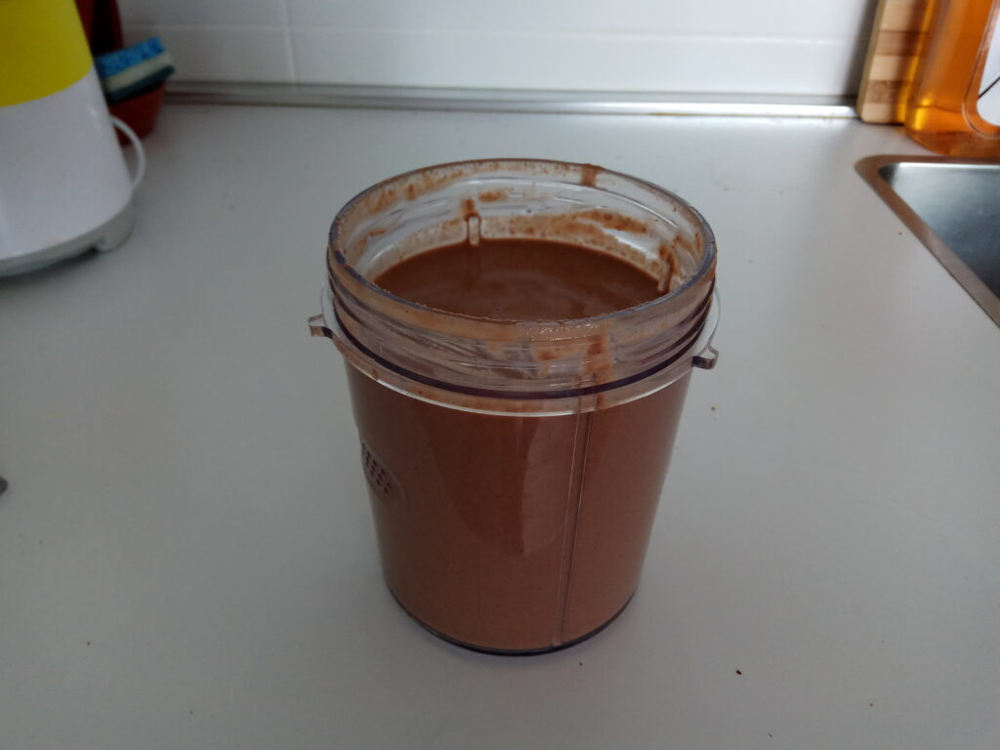
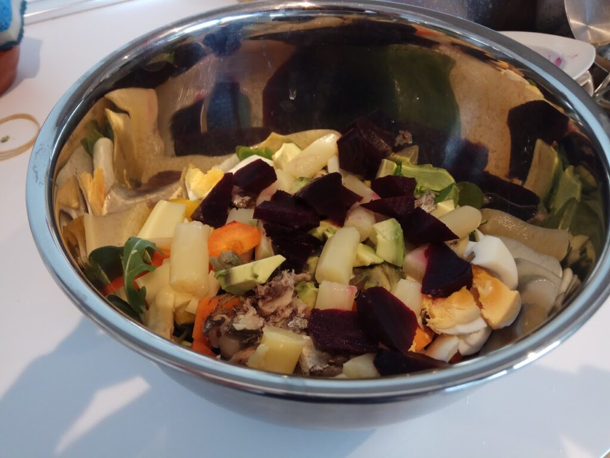

#### El problema del tiempo

No iba a publicar este post, que lo escribí hace tiempo, pero me he decidido al final para hacer una especie de pausa veraniega antes de lo que publicaré a partir de la semana que viene. Droga dura. Prepárate 😆.

Uno de los principales escollos que solemos encontrarnos cuando decidimos hacer una mejora en nuestra nutrición es la **falta de tiempo**. En muchas ocasiones, hemos apostado por comida ya procesada y preparada que nos ha proporcionado tener la comida lista con sólo calentarla o quizás ni eso, dependiendo del plato.

En el desayuno, por ejemplo, muchas veces por la educación recibida desde pequeños, tomamos una taza o tazón de leche, café o Colacao con galletas o cereales. Te interesará seguramente en este caso echar un vistazo a los **porcentajes de azúcar del Colacao/Nesquick, las galletas o los cereales típicos del desayuno**.

Por nuestra cultura popular, esta **comida es especialmente difícil de cambiar**, pues le asociamos unos productos muy específicos. Normalmente dulces y de ingesta rápida. A much@s de nosotr@s nos parece difícil imaginarnos desayunando unas alubias y unas pechugas de pollo, o un estofado (aunque algun@s de nosotr@s lo solemos hacer en esos self-service mágicos de los hoteles 😁). Pero curiosamente parece que sería nuestra mejor apuesta. Nos quitaríamos de los dulces, mejorariamos en calidad nutricional y reduciríamos el apetito por la comida del mediodía. **Las sobras de la cena o comida del día anterior parecen ser el mejor desayuno**.

Aunque, no nos engañemos, esto puede ser *too much* para muchos nosotros. Y en este blog eso del *too much* no mola. Tu filosofía de nutrición tiene que impactar positivamente en todos los apartados tu nuestra vida. Y caer en la autoexigencia los deteriora. Por eso te quiero presentar una alternativa fácil de preparar, sana y más parecida al desayuno estándar.

Eso en cuanto al desayuno. Pero **otra comida que nos suele dar *problemas***, al menos a mí, **es la cena**. Suelo llegar tarde a casa, cansado, y con ganas de cenar rápido para no ir con la panza llena a la cama. Esta situación suele llevarnos a tirar de procesados o cenas poco sanas pero que se puedan hacer rápidamente. O quizás peor, a caer en una [**autoexigencia extrema**](/desperfeccionate/por-que-el-perfeccionismo-no-es-util/) y priorizar una alimentación saludable sobre otros aspectos igual de importantes (relaciones, deporte, ocio, etc.)

#### Solución para el desayuno: Batido healthy

Los batidos son una buena opción en general para tirar de alimentos frescos y no procesados. Aunque hay que tener cuidado con el azúcar (en los zumos, sobre todo). Aquí os dejo la **mejor opción** que yo he encontrado para empezar la mañana con energía de la buena 😉.

Lo primero que necesitas en una **batidora** decente. Tampoco tiene que ser la *leche.* Yo tengo una normalita que compré en Amazon hará ya 3 años. La verdad, al principio no sabía bien como utilizarla y me la cambiaron 2 veces. Al final aprendí la lección: no apretar el vaso hacia abajo cuando la batidora está en marcha 😜. Ella ya viene con unas «clavijas» para dejar fijo el vaso.

Lo bueno de esta batidora es que viene con un **vaso pequeño** de uso individual. La mayoría incluye sólo esos megavasos que me parecen desorbitados y que pueden alimentar a familias enteras (igual me estoy perdiendo algo).

Entonces, cojo el vaso pequeño de la batidora y le pongo:

1.  Una cantidad considerable de kéfir o yogur griego (unos 3 dedos de altura).
2.  Media cucharadita de miel.
3.  Una cucharadita de canela.
4.  Dos cucharadas de cacao en polvo puro (sin azúcar, NO Colacao).
5.  Otras 3-4 cucharadas de coco rallado.
6.  Un puñado de frutos secos crudos (nueves, avellanas, almendras, lo que más te guste). Suelo irlos variando.
7.  Dos huevos crudos (proteína de la buena, jeje).
8.  Un plátano u otra fruta. Si utilizas una fruta menos densa o añades un poco de agua el batido queda más líquido.

Cerramos el vaso, lo ponemos en la batidora unos 15 segundos… ¡Y listo! Desayuno supersano preparado **para tomar o llevar**.

**Tiempo de preparación: 5-10 minutos.**

Yo incluso me preparo todo menos los huevos y el plátano el día anterior para ahorrar tiempo a la mañana.

De esta forma conseguimos un desayuno dulce (depende de que cantidad de miel que le eches será más o menos dulce), rápido y sano. Una buena forma de cambiar esta importante comida del día a algo mucho mejor sin necesidad de comerte las sardinas de la cena de ayer.

**Bonus track**: Otra opción, que suelo reservar para el fin de semana, es hacerme una **tortilla francesa** con espinacas, pimientos y cebolla. Rica, ligera y te llena de energía desde primera hora de la mañana 💪💪.

#### Solución para la cena: Ensalada rápida, completa y nutritiva

Aquí no hago nada nuevo proponiendo hacernos una ensalada como método para elaborar una cena rápida y sana. Pero os voy a presentar la que suelo hacer yo (con ciertos variantes de vez en cuando).

Para mí la ensalada es un **plato para todo el año**, no sólo para el verano. He leído en varios sitios que cocinar la verdura también es beneficioso, sobre todo en los meses fríos. Pero yo opto por una manera rápida y que me permite también hacer la compra semanal rápidamente sin *comerme mucho el tarro* y sin miedo a que se pongan las cosas malas por no cocinarlas y comerlas a tiempo.

Mi ensalada se compone de:

1.  Una base de hoja verde (espinacas, rúcula, acelga, lechuga…)
2.  Tiras de pimientos rojos o verdes crudos (si prefieres cocinarlos, pues sin problema)
3.  Tiras de cebolla
4.  Una zanahoria en trocitos
5.  Varios daditos de queso curado.
6.  Un huevo cocido
7.  Un lata de caballa/sardinas/atún.
8.  Medio aguacate
9.  Espárragos/remolacha/tomate cherry

Lo aliño con medio limón, aceite y vinagre.

**Tiempo de preparación: 15-20 minutos.**

En este caso suelo, a veces, dejar la ensalada preparada con antelación (sin aliñar para que la verdura no se ponga *pocha*).

Hay gente que le parece mucho (es un buen cancarro), pero te comes una pieza de fruta después (si tienes ganas) y, al saciarte bien, se te quita la gula de comer nada luego (los típicos dulces). En mi caso, sin embargo, suele caer alguna onza de chocolate 😊.

Imagínate que incorporas estas recetas en 4 de los 7 días de la semana. Ya estarías asegurando comer sano y de manera sencilla en 8 de las 21 comidas principales del día. Una cifra nada desdeñable. Recuerda, se trata de **equilibrar entre una alimentación saludable y otros aspectos que te aportan bienestar a tí y a las personas de tu entorno**. La regla del 80/20 aplica muy bien en nutrición y deporte 😉.

#### Suscripción

Si te ha gustado el post y deseas recibir semanalmente el extracto de los posts que voy publicando puedes apuntarte a la lista de distribución del blog en [**este enlace**](http://eepurl.com/g86S-b).

Igual incluso me animo a dar alguna sorpresa de vez en cuando 😉.
